# Event-triggered extended dissipativity stabilization of semi-Markov switching systems

## Abstract

This paper is concerned with event-triggered extended dissipativity stabilization of uncertain semi-Markov switching systems with external disturbances. The purpose is to ensure the stochastic stability and extended dissipativity of the semi-Markov switching systems via using event-triggered control. A mode- and disturbance-dependent switched event-triggered mechanism is devised to determine the triggered moments, which can further reduce the number of triggered events compared to some existing switched eventtriggered mechanisms. On the basis of the proposed mechanism, a time- and modedependent piecewise-defined Lyapunov functional is constructed to establish a criterion for the stochastic stability and extended dissipativity. Subsequently, a co-design scheme for the needed feedback-gain and event-triggered matrices is presented using some equivalent transformations of matrix inequalities. Lastly, a DC motor model and a robotic arm model are utilized to illustrate the validity of the designed controller.

# 1. Introduction

Random behaviors, such as failures and repairs of components, as well as interconnection variations, may result in abrupt changes in the structure or parameters of a control system [1]. In order to describe, explain, predict and control state evolution trends of this class of systems, various Markov switching systems (MSSs) modeled by linear or nonlinear differential equations have been developed [2,3]. A MSS, generally speaking, is composed of a family of interconnected subsystems that correspond to different modes (subsystems) and switch from one mode to another under the control of a continuous- or discrete-time Markov Process. The mode remains the same between any two consecutive random switches. MSSs, therefore, have been applied in many practical systems, including target tracking systems [4], networked control systems [5], wheeled mobile manipulators [6], and tunnel diode circuits [7].

The duration between any two successive random switches in MSSs, also known as the sojourn time, is a stochastic variable, follows the exponential distribution (ED) in the continuous-time system domain. The transition rates are constant in terms of the memoryless property of the ED. It means that the switching speed between different modes does not depend on the past of the Markov process [8鈥?1]. This feature limits the application of MSSs to some extent and makes it can only be used to model stochastic systems with constant transition rates. A possible way is to adopt a semi-Markov process instead of a Markov process to characterize the random switches between modes. As stated in [12,13], the sojourn time

in the semi-Markov process is allowed to obey a more general distribution and the corresponding transition rate is timevarying in contrast to the Markov process. Accordingly, semi-Markov switching systems (semi-MSSs) relax the memoryless restriction in the distribution and have a wider application range than MSSs [14]. Hence, it is of considerable theoretical and practical interest to analyze and control semi-MSSs.

A practical semi-MSSs is subject to external disturbances to different degrees. The disturbances may worsen the system performance and even lead to control failure. To reach a satisfactory effect, various control strategies against disturbances, including $\mathcal { H } _ { \infty }$ control [15鈥?7], $\mathcal { L } _ { 2 } - \mathcal { L } _ { \infty }$ control [18鈥?0], and passive control [21], have been used to semi-MSSs. The extended dissipativity performance index introduced in [22] is comprehensive, covering $\mathcal { H } _ { \infty }$ , $\mathcal { L } _ { 2 } - \mathcal { L } _ { \infty }$ , and passivity performance indexes as special cases. For this reason, extended dissipativity control of semi-MSSs has attracted growing attention over recent years. In [23], a non-fragile control approach based on linear matrix inequlities (LMIs) was presented for ensuring the consensus and extended dissipativity of semi-Markov switching multiagent systems. In [24], a state-feedback extended dissipativity control method was proposed for semi-Markov switching neural networks with uncertain transition rates. A class of delayed singular semi-MSSs were considered in [25], where an anti-disturbance extended dissipativity controller design was developed.

With the development of communication technologies, event-triggered control (ETC) has become a spotlight in the control community as it is a perfect candidate for relieving the over-occupation of communication channels [26]. A new measurement will be sent to update the data of the controller only when the change of system states exceeds a certain preset threshold in the trigger condition. By using the ETC, one can achieve a balance between the improvement of resource utilization and expected system performance by setting specific trigger conditions. To date, several meaningful event-triggered mechanisms (ETMs) have been put forward, including the continuous ETM [27], periodic ETM [28], and switched ETM (SETM) [29]. As shown in [29], the time intervals between any two successively triggered moments are not less than a predefined positive constant, therefore avoiding the so-called Zeno phenomenon effectively. In addition, the SETM can significantly reduce the number of triggered events (NTEs) compared to other ETMs. Subsequent research results further confirmed the effectiveness and efficiency such a ETM [30鈥?3]. Summing up the above discussion, this paper focuses on the issue of extended dissipativity stabilization for semi-MSSs based on switched ETC. Our contributions are summarized as follows:

(1) A new SETM, where the threshold function contains a mode-dependent event-triggered matrix and a disturbance term, is introduced to determine the triggered moments. Compared with some existing SETMs, the proposed mode- and disturbance-dependent SETM (MDSETM) can further reduce the NTEs while maintaining control performance.

(2) A criterion for stochastic stability and extended dissipativity of the closed-loop semi-MSSs is established by applying a time- and mode-dependent piecewise-defined Lyapunov functional (LF), the Jensen inequality, and the generalized Dynkin formula.

(3) The issue of extended dissipativity stabilization is addressed via using the established criterion and some equivalent transformations of matrix inequalities. A co-design for the needed feedback-gain and event-triggered matrices is proposed based on a feasible solution of LMIs.

Notations: We use $\mathcal { N } ^ { + } , \mathbb { R } ^ { l }$ , and $\mathbb { R } ^ { l \times m }$ to represent the collection of non-negative integers, l-dimensional Euclidean space, as well as the collection of $l \times m$ real matrices, respectively. $\mathcal { L } _ { 2 } [ 0 , \infty )$ refers to the space of square-integrable vector functions over $\lbrack 0 , \infty )$ . We denote a diagonal matrix by diag {路}, use symbol $^ *$ to represent a term in a symmetrical matrix that can be inferred by the symmetric feature, and use $c o l \{ z _ { 1 } , z _ { 2 } \}$ to represent a column vector with entries $z _ { 1 }$ and $z _ { 2 }$ . For a square matrix Z, we use $Z > 0$ to stand for that $Z$ is symmetric positive definite, $Z \geq 0$ to stand for that Z is semi-positive definite, and $s ( Z )$ to stand for $\begin{array} { r } { S ( Z ) = Z + Z ^ { T } } \end{array}$ . Furthermore, we denote by $| | \cdot | |$ the Euclidean vector norm and use $\mathcal { E } \{ \cdot \}$ to denote the mathematical expectation operator.

# 2. Preliminaries

Consider the following uncertain semi-MSS with disturbances:

$$
\dot {x} (t) = \bar {A} (\varsigma (t)) x (t) + B (\varsigma (t)) u (t) + C (\varsigma (t)) \varpi (t),
$$

$$
y (t) = D (\varsigma (t)) x (t), \tag {1}
$$

$$
x (0) = 0, \quad \varsigma (0) = \varsigma_ {0},
$$

where where $\ b { x } ( t ) \in \mathbb { R } ^ { n _ { a } }$ is the state of the semi-MSS; $u ( t ) \in \mathbb { R } ^ { n _ { b } }$ is the control input; $\ b { y } ( t ) \in \mathbb { R } ^ { n _ { b } }$ is the output; $\varpi ( t ) \in \mathbb { R } ^ { k }$ denotes the external disturbances belong to $\mathcal { L } _ { 2 } [ 0 , \infty )$ ; $ { \bar { A } } ( \varsigma ( t ) ) = A ( \varsigma ( t ) ) + \Delta A ( \varsigma ( t ) ) , B ( \varsigma ( t ) )$ , $C ( \zeta ( t ) )$ , $D ( \zeta ( t ) )$ are system parameter matrices with proper dimensions; $\Delta A ( \varsigma ( t ) )$ represents the system uncertainty; $\{ \varsigma ( t ) , t \ge 0 \}$ is a semi-Markov process that takes its values in $\bar { N } = \{ 1 , 2 , \cdots , N \}$ , $N \in \mathcal { N } ^ { + }$ . The transition probabilities of $\{ \varsigma ( t ) , t \ge 0 \}$ satisfy

$$
\operatorname * {P r} \{\varsigma (t + \iota) = j | \varsigma (t) = i \} = \left\{ \begin{array}{l l} \lambda_ {i j} (\iota) \iota + o (\iota), & i \neq j, \\ 1 + \lambda_ {i i} (\iota) \iota + o (\iota), & i = j, \end{array} \right.
$$

where $\iota > 0$ denotes the sojourn time, $o ( \iota )$ means the higher-order infinitesimal of $\iota$ satisfying $l i m _ { \iota  0 } o ( \iota ) / \iota = 0$ , and $\lambda _ { i j } ( \iota )$ is the transition rate from mode i to mode $j$ at t with $\lambda _ { i j } ( \iota ) > 0 ( i \neq j )$ and $\begin{array} { r } { \lambda _ { i i } ( \iota ) = - \sum _ { j = 1 , j \neq i } ^ { N } \lambda _ { i j } ( \iota ) } \end{array}$ [34].

Remark 1. The semi-MSS in (1) consists of a set of continuous-time subsystems and a switching signal obeying the semi-Markov process. Many complex systems in electrical and mechanical engineering, such as the boost converter circuit [35], the DC motor [36,37], and the robotic arm [38], can be modeled as such a system. The semi-Markov process, in which the transition rate depends upon the sojourn time, is more general than the usual Markov process. Therefore, the semi-MSS under consideration possesses a broad application potential.

For semi-MSS in (1), the following three assumptions are made:

Assumption 1. [39] The parameter pair $( \bar { A } ( \varsigma ( t ) ) , B ( \varsigma ( t ) ) )$ is controllable.

Assumption 2. [40] The disturbances are measurable.

Assumption 3. [41,42] The parameter uncertainty satisfies

$$
\Delta A (\varsigma (t)) = E (\varsigma (t)) \Delta (t) F (\varsigma (t)), \tag {2}
$$

where matrices $E ( \zeta ( t ) )$ and $F ( \zeta ( t ) )$ are known; matrix $\Delta ( t )$ is unknown but satisfy $\Delta ^ { T } ( t ) \Delta ( t ) \leq I .$

Remark 2. Controllability, which concerns the ability to provide acceptable dynamic performance through feedback control, is a fundamental property of a control system. The measurability assumption of disturbances, which has been used in many references, will play a significant role in subsequent ETM design. The parameter uncertainty is assumed to have a normbounded form, which is more general than the usual interval uncertainty form [43].

The stabilization issue of semi-MSS (1) will be discussed under the frame of a MDSETM-based control. The controller, which is updated at time moments

$$
0 = t _ {0} <   t _ {1} <   t _ {2} <   \dots <   t _ {s} <   \dots , \lim _ {s \rightarrow \infty} t _ {s} = \infty ,
$$

is given as

$$
u (t) = B (\varsigma (t)) K (\varsigma (t)) x \left(t _ {s}\right), t \in \left[ t _ {s}, t _ {s + 1}\right), s = 0, 1, 2, \dots \tag {3}
$$

The event-trigger condition to determine the triggered moments is given as

$$
t _ {s + 1} = \min  \left\{t \geq t _ {s} + d \right| (x (t) - x (t _ {s})) ^ {T} \Lambda (\zeta (t)) (x (t) - x (t _ {s})) \geq \sigma x ^ {T} (t) \Lambda (\zeta (t)) x (t) + \delta \varpi^ {T} (t) \varpi (t) \} \tag {4}
$$

with scalars $\sigma \geq 0 , \ d > 0 , \ \delta \geq 0$ , where $\Lambda ( \varsigma ( t ) ) \geq 0$ is a mode-dependent event-triggered matrix and d denotes the lowest sampling period. The following is the working principle of the MDSETM: Suppose that the controller receives the measurement at time moment $t _ { s }$ . Then, the sensor will suspend sending measurement for d seconds. When t comes to time moment $t _ { s } + d$ , the sensor begins to continuously monitor event-trigger condition (4). If the condition is met, then the sensor will send a new measurement to update controller (3) at trigger moment $t _ { s + 1 }$ . In this way, the time intervals between any two successively triggered moments are not less than d, therefore avoiding the Zeno phenomenon effectively.

Under the proposed MDSETM, the controller in (3) can be recast as

$$
u (t) = \left\{ \begin{array}{l} B (\varsigma (t)) K (\varsigma (t)) x (t - \theta (t)), t \in [ t _ {s}, t _ {s} + d), \\ B (\varsigma (t)) K (\varsigma (t)) [ x (t) + e (t) ], t \in [ t _ {s} + d, t _ {s + 1}) \end{array} \right. \tag {5a}
$$

with $\theta ( t ) = t - t _ { s } \leq d$ , $t \in [ t _ { s } , \ t _ { s } + d )$ , $e ( t ) = x ( t _ { s } ) - x ( t ) , \ t \in [ t _ { s } + d , t _ { s + 1 } )$ . Accordingly, we are able to transform semi-MSS (1) into the following switched system:

$$
\dot {x} (t) = \left\{ \begin{array}{l} \bar {A} (\varsigma (t)) x (t) + C (\varsigma (t)) \varpi (t) + B (\varsigma (t)) K (\varsigma (t)) x (t - \theta (t)), t \in [ t _ {s}, t _ {s} + d), \\ \bar {A} (\varsigma (t)) x (t) + C (\varsigma (t)) \varpi (t) + B (\varsigma (t)) K (\varsigma (t)) [ x (t) + e (t) ], t \in [ t _ {s} + d, t _ {s + 1}). \end{array} \right. \tag {6b}
$$

Letting $\varsigma ( t ) = i \in \bar { N }$ , the Ai, Bi, Ci, Di, Ai, Ei, Fi, $\bar { A } _ { i }$ , Ki, $\Lambda _ { i }$ are used to replace the matrices in system (1), which is beneficial to simplicity of notation.

Remark 3. Under the proposed MDSETM, the controller allows periodic sampling for $t \in [ t _ { s } , t _ { s } + d )$ and continuous event triggering for $t \in [ t _ { s } + d , t _ { s + 1 } )$ , resulting in a switched closed-loop system (SCLS). When $\Lambda ( \varsigma ( t ) ) = \Lambda$ , the event-triggered matrix is mode-independent, and the MDSETM will reduces to the SETM given in [44]; when further restricting $\delta = 0$ , the threshold function is independent of disturbances, and the MDSETM will reduces to the SETM given in [29]. Compared to the periodic sampling mechanism (PSM) in [45] and SETMs in [29,44], the introduction of a mode-dependent event-triggered matrix and disturbance term into the threshold function contributes to further reducing the NTEs while maintaining control performance, which will be demonstrated in Section 4.

We recall the following two concepts and two lemma:

Definition 1. [46] Semi-MSS (1) with all modes is said to be stochastically stable if, when $\varpi ( t ) = 0$ , there exist a positive scalar $M _ { \diamond }$ such that

$$
\varepsilon \left(\int_ {0} ^ {\infty} | | x (\mu) | | ^ {2} d \mu\right) \leq M _ {\circ}. \tag {7}
$$

Definition 2. [22] For given real matrices $\Upsilon _ { i } ( i = 1 , \cdots , 4 )$ satisfying $\Upsilon _ { 1 } \leq 0$ , $\Upsilon _ { 2 }$ , 蠏3 > 0, $\Upsilon _ { 4 } \geq 0$ and $( | | \Upsilon _ { 1 } | | +$ $| | \Upsilon _ { 2 } | | ) | | \Upsilon _ { 4 } | | = 0$ , suppose, under condition $x ( 0 ) = 0$ ,

$$
\sup  _ {t \geq 0} \left\{\mathcal {E} \left(x ^ {T} (t) \Upsilon_ {4} x (t)\right) \right\} \leq \mathcal {E} \left(\int_ {0} ^ {t} J (\mu) p d \mu\right) \tag {8}
$$

holds for any $t \geq 0$ , where

$$
J (t) = x ^ {T} (t) \Upsilon_ {1} x (t) + 2 x ^ {T} (t) \Upsilon_ {2} \varpi (t) + \varpi^ {T} (t) \Upsilon_ {3} \varpi (t).
$$

Then, semi-MSS (6) is said to be extended dissipative.

Lemma 1. [47, 48] (Jensen鈥檚 inequality) For any $l \times l$ dimensions matrix $W > 0$ , scalars $a _ { 1 }$ and $a _ { 2 }$ with $a _ { 2 } > a _ { 1 }$ , and vector function $\delta : [ a _ { 1 } , a _ { 2 } ]  \mathbb { R } ^ { l }$ ,

$$
\frac {1}{\left(a _ {2} - a _ {1}\right)} \int_ {a _ {1}} ^ {a _ {2}} \delta^ {T} (\mu) d \mu W \int_ {a _ {1}} ^ {a _ {2}} \delta (\mu) d \mu \leq \int_ {a _ {1}} ^ {a _ {2}} \delta^ {T} (\mu) W \delta (\mu) d \mu
$$

holds.

Lemma 2. [49] For proper dimensions matrices $L _ { 1 } ( L _ { 1 } ^ { T } = L _ { 1 } )$ ), $L _ { 2 } , L _ { 3 }$ , and $\Delta ( t ) ( \Delta ^ { T } ( t ) \Delta ( t ) \leq I ) ,$

$$
L _ {1} + \mathcal {S} (L _ {3} \Delta (t) L _ {2}) <   0
$$

holds if and only if there is a constant $\epsilon > 0$ such that

$$
L _ {1} + \epsilon^ {- 1} L _ {3} L _ {3} ^ {T} + \epsilon L _ {2} ^ {T} L _ {2} <   0.
$$

Remark 4. The extended dissipativity, which has been widely studied for a variety of control systems; see, e.g., [50鈥?2], is quite comprehensive. In fact, the extended dissipativity condition in (8) can be transformed into the $\mathcal { H } _ { \infty }$ performance condition by setting $\Upsilon _ { 1 } = - I , \Upsilon _ { 2 } = 0 , \Upsilon _ { 3 } = \gamma ^ { 2 } I , \Upsilon _ { 4 } = 0$ $\Upsilon _ { 4 } = 0$ [15鈥?7], $\mathcal { L } _ { 2 } - \mathcal { L } _ { \infty }$ performance condition by setting $\Upsilon _ { 1 } = 0$ , 蠏2 = 0, $\Upsilon _ { 3 } = \gamma ^ { 2 } I$ , $\Upsilon _ { 4 } = I$ [18鈥?0], the passivity performance condition by setting $\Upsilon _ { 1 } = 0$ $\Upsilon _ { 1 } = 0 , \Upsilon _ { 2 } = I , \Upsilon _ { 3 } = \gamma I , \Upsilon _ { 4 } = 0$ $\Upsilon _ { 4 } = 0$ [21], as well as $( { \mathcal { Q } } , { \mathcal { S } } , { \mathcal { R } } )$ -dissipativity performance condition by setting $\Delta _ { 1 } = Q , ~ \Delta _ { 2 } = S , ~ \Delta _ { 3 } = R - \gamma I , ~ \Delta _ { 4 } = 0$ $\Delta _ { 4 } = 0$ [53].

In this paper, we are intended to achieve the extended dissipativity stabilization of semi-MSSs via utilizing the proposed the MDSETM. To be specific, we would like to determine the feedback-gain matrix in (3) and event-triggered matrices in (4) for ensuring that uncertain semi-MSS in (1) is not only stochastically stable but also extended dissipative.

# 3. Main results

First, we give a result for the need performance analysis of semi-MSS (6).

Theorem 1. For given real matrices $\Upsilon _ { 1 } \leq 0 _ { : }$ , $\Upsilon _ { 2 }$ , $\Upsilon _ { 3 } > 0$ , and $\Upsilon _ { 4 } \geq 0$ satisfying $( | | \Upsilon _ { 1 } | | + | | \Upsilon _ { 2 } | | ) \cdot | | \Upsilon _ { 4 } | | = 0$ , and scalars $\varepsilon _ { 1 }$ , $\varepsilon _ { 2 } , \gamma > 0 , \delta \geq 0 , d > 0 , \alpha > 0 , \sigma \geq 0 ,$ $\sigma \ge 0$ suppose that, for any $i \in \bar { N } ,$ , there exist matrices $P _ { i } > 0$ $P _ { i } > 0 , U > 0 , \bar { Q } = \left[ \begin{array} { l l } { { Q _ { 1 } } } & { { \ Q _ { 2 } } } \\ { { * } } & { { \ Q _ { 3 } } } \end{array} \right] > 0 , Y ,$ $H _ { m }$ $m = 1 , 2 , 3 , 4 , 5$ ), $G _ { n }$ $( n = 1 , 2 , 3 , 4 )$ ) and matrix $\Lambda _ { i } \geq 0$ such that

$$
\Psi (i) = \left[ \begin{array}{c c c c c c} \Psi_ {1 1} (i) & \Psi_ {1 2} (i) & \Psi_ {1 3} (i) & \Psi_ {1 4} & \Psi_ {1 5} (i) & \Psi_ {1 6} \\ * & \Psi_ {2 2} & \Psi_ {2 3} (i) & 0 & \Psi_ {2 5} (i) & \Psi_ {2 6} \\ * & * & \Psi_ {3 3} (i) & \Psi_ {3 4} & \Psi_ {3 5} (i) & \Psi_ {3 6} \\ * & * & * & \Psi_ {4 4} & 0 & \Psi_ {4 6} \\ * & * & * & * & \Psi_ {5 5} & 0 \\ * & * & * & * & * & \Psi_ {6 6} \end{array} \right] <   0, \tag {9}
$$

$$
\Theta (i) = \left[ \begin{array}{c c c c c} \Theta_ {1 1} (i) & \Theta_ {1 2} (i) & \Theta_ {1 3} (i) & \Theta_ {1 4} & \Theta_ {1 5} (i) \\ * & \Theta_ {2 2} & \Theta_ {2 3} (i) & \Theta_ {2 4} & \Theta_ {2 5} (i) \\ * & * & \Theta_ {3 3} (i) & \Theta_ {3 4} & \Theta_ {3 5} (i) \\ * & * & * & \Theta_ {4 4} & 0 \\ * & * & * & * & \Theta_ {5 5} \end{array} \right] <   0, \tag {10}
$$

$$
\Phi (i) = \left[ \begin{array}{c c c c} \Phi_ {1 1} (i) & \Phi_ {1 2} (i) & \Phi_ {1 3} (i) & \Phi_ {1 4} (i) \\ * & \Phi_ {2 2} & \Phi_ {2 3} (i) & \Phi_ {2 4} (i) \\ * & * & \Phi_ {3 3} (i) & 0 \\ * & * & * & \Phi_ {4 4} \end{array} \right] <   0, \tag {11}
$$

$$
\Xi (i) = \left[ \begin{array}{c c c} P _ {i} + d \mathcal {S} \left(\frac {H _ {1}}{2}\right) - \Upsilon_ {4} & - d H _ {1} + d H _ {2} & d H _ {3} \\ * & - d \mathcal {S} \left(H _ {2} - \frac {H _ {1}}{2}\right) & d H _ {4} \\ * & * & d \mathcal {S} \left(\frac {H _ {5}}{2}\right) \end{array} \right] > 0, \tag {12}
$$

$$
P _ {i} - \Upsilon_ {4} > 0 \tag {13}
$$

hold, where

$$
\Psi_ {1 1} (i) = \sum_ {j = 1} ^ {N} \lambda_ {i j} ^ {*} P _ {j} + 2 \alpha P _ {i} + \mathcal {S} \left(- \frac {H _ {1}}{2} + G _ {1} + Y \bar {A} _ {i}\right) - \mathrm {Y} _ {1},
$$

$$
\Psi_ {1 2} (i) = P _ {i} + G _ {2} - Y + \varepsilon_ {1} \bar {A} _ {i} ^ {T} Y ^ {T},
$$

$$
\Psi_ {1 3} (i) = H _ {1} - H _ {2} + G _ {3} - G _ {1} ^ {T} + Y B _ {i} K _ {i} + \varepsilon_ {2} \bar {A} _ {i} ^ {T} Y ^ {T},
$$

$$
\Psi_ {1 4} = - H _ {3} + G _ {4}, \Psi_ {1 5} (i) = Y C _ {i} - \Upsilon_ {2},
$$

$$
\Psi_ {1 6} = \sqrt {d} G _ {1} ^ {T}, \Psi_ {2 2} = - S (\varepsilon_ {1} Y),
$$

$$
\Psi_ {2 3} (i) = - G _ {2} ^ {T} - \varepsilon_ {2} Y ^ {T} + \varepsilon_ {1} Y B _ {i} K _ {i},
$$

$$
\Psi_ {2 5} (i) = \varepsilon_ {1} Y C _ {i}, \Psi_ {2 6} = \sqrt {d} G _ {2} ^ {T},
$$

$$
\Psi_ {3 3} (i) = \mathcal {S} \left(H _ {2} - \frac {H _ {1}}{2} - G _ {3} + \varepsilon_ {2} Y B _ {i} K _ {i}\right) - d e ^ {- 2 \alpha d} Q _ {3},
$$

$$
\Psi_ {3 4} = - H _ {4} - e ^ {- 2 \alpha d} Q _ {2} ^ {T} - G _ {4}, \Psi_ {3 5} (i) = \varepsilon_ {2} Y C _ {i}, \Psi_ {3 6} = \sqrt {d} G _ {3} ^ {T},
$$

$$
\Psi_ {4 4} = - \mathcal {S} \left(\frac {H _ {5}}{2}\right) - \frac {e ^ {- 2 a d}}{d} Q _ {1}, \Psi_ {4 6} = \sqrt {d} G _ {4} ^ {T},
$$

$$
\Psi_ {5 5} = - Y _ {3}, \Psi_ {6 6} = - e ^ {- 2 \alpha d} U,
$$

$$
\Phi_ {1 1} (i) = \sum_ {\nu = 1, j} ^ {N} \lambda_ {i j} ^ {*} P _ {j} + 2 \alpha P _ {i} + \sigma \Lambda_ {i} + \mathcal {S} \left(Y \bar {A} _ {i} + Y B _ {i} K\right) - \mathrm {Y} _ {1},
$$

$$
\Phi_ {1 2} (i) = P _ {i} - Y + \varepsilon_ {1} \bar {A} _ {i} ^ {T} Y ^ {T} + (\varepsilon_ {1} Y B _ {i} K _ {i}) ^ {T},
$$

$$
\Phi_ {1 3} (i) = Y B _ {i} K _ {i}, \Phi_ {1 4} (i) = Y C _ {i} - \mathrm {Y} _ {2},
$$

$$
\Phi_ {2 2} = S \left(- \varepsilon_ {1} Y\right), \Phi_ {2 3} (i) = \varepsilon_ {1} Y B _ {i} K _ {i}, \Phi_ {2 4} (i) = \varepsilon_ {1} Y C _ {i},
$$

$$
\Phi_ {3 3} (i) = - \Lambda_ {i}, \Phi_ {4 4} = \delta I - Y _ {3},
$$

$$
\Theta_ {1 1} (i) = \Psi_ {1 1} (i) + \alpha d S \left(H _ {1}\right) + d S \left(H _ {3}\right) + d Q _ {1} - Y _ {1},
$$

$$
\Theta_ {1 2} (i) = \Psi_ {1 2} (i) + d \frac {S \left(H _ {1}\right)}{2},
$$

$$
\Theta_ {1 3} (i) = \Psi_ {1 3} (i) + 2 \alpha d \left(H _ {2} - H _ {1}\right) + d H _ {4} ^ {T} + d Q _ {2},
$$

$$
\Theta_ {1 4} = \Psi_ {1 4} + 2 \alpha d H _ {3} + d \frac {S (H _ {5})}{2}, \Theta_ {1 5} (i) = Y C _ {i} - Y _ {2}
$$

$$
\Theta_ {2 2} = \Psi_ {2 2} + d U, \Theta_ {2 3} (i) = \Psi_ {2 3} (i) + d \left(H _ {2} - H _ {1}\right),
$$

$$
\Theta_ {2 4} = d H _ {3}, \Theta_ {2 5} (i) = \varepsilon_ {1} Y C _ {i},
$$

$$
\Theta_ {3 3} (i) = S \left(H _ {2} - \frac {H _ {1}}{2} - G _ {3} + \varepsilon_ {2} Y B _ {i} K _ {i}\right) + 2 \alpha d S \left(- H _ {2} + \frac {H _ {1}}{2}\right) + d Q _ {3},
$$

$$
\Theta_ {3 4} = \Psi_ {3 4} + 2 \alpha d H _ {4}, \Theta_ {3 5} (i) = \varepsilon_ {2} Y C _ {i}
$$

$$
\Theta_ {4 4} = \Psi_ {4 4} + \alpha d S (H _ {5}), \Theta_ {5 5} = - Y _ {3}, \lambda_ {i j} ^ {*} = \mathcal {E} \left\{\lambda_ {i j} (\iota) \right\}.
$$

Then, semi-MSS (6) is stochastic stable and extended dissipative.

Proof. Consider time- and mode-dependent piecewise-defined LF:

$$
V (t, \varsigma (t)) = \left\{ \begin{array}{l} V _ {\alpha} (t, \varsigma (t)), t \in [ t _ {s}, t _ {s} + d), \\ V _ {\beta} (t, \varsigma (t)), t \in [ t _ {s} + d, t _ {s + 1}), \end{array} \right.
$$

where $\begin{array} { r } { V _ { \alpha } ( t , \varsigma ( t ) ) = \sum _ { m = 1 } ^ { 4 } V _ { m } ( t , \varsigma ( t ) ) } \end{array}$ ), V尾 (t, 蟼 (t )) = V1(t, 蟼 (t )) with

$$
V _ {1} (t, \varsigma (t)) = e ^ {2 \alpha t} x ^ {T} (t) P _ {\varsigma (t)} x (t),
$$

$$
V _ {2} (t, \varsigma (t)) = \theta_ {d} (t) \int_ {t - \theta (t)} ^ {t} e ^ {2 \alpha \mu} \dot {x} ^ {T} (\mu) U \dot {x} (\mu) d \mu ,
$$

$$
V _ {3} (t, \varsigma (t)) = \theta_ {d} (t) \int_ {t - \theta (t)} ^ {t} e ^ {2 \alpha \mu} \eta_ {1} ^ {T} (\mu) \bar {Q} \eta_ {1} (\mu) d \mu ,
$$

$$
V _ {4} (t, \varsigma (t)) = \theta_ {d} (t) e ^ {2 \alpha t} \eta_ {2} ^ {T} (t) \mathcal {F} \eta_ {2} (t),
$$

and

$$
\begin{array}{l} \theta_ {d} (t) = d - \theta (t), \eta_ {1} (\mu) = c o l \{x (\mu), x (\mu - \theta (\mu)) \}, \\ \eta_ {2} (t) = c o l \left\{x (t), x (t - \theta (t)), \int_ {t - \theta (t)} ^ {t} x (\mu) d \mu \right\}, \\ \mathcal {F} = \left[ \begin{array}{c c c} \mathcal {S} (\frac {H _ {1}}{2}) & - H _ {1} + H _ {2} & H _ {3} \\ * & \mathcal {S} (- H _ {2} + \frac {H _ {1}}{2}) & H _ {4} \\ * & * & \mathcal {S} (\frac {H _ {5}}{2}) \end{array} \right]. \\ \end{array}
$$

Note that

$$
\begin{array}{l} V _ {1} (t, \varsigma (t)) + V _ {4} (t, \varsigma (t)) \\ = e ^ {2 \alpha t} \eta_ {2} ^ {T} (t) \left[ \begin{array}{c c c} P _ {\varsigma (t)} + \theta_ {d} (t) \mathcal {S} \Big (\frac {H _ {1}}{2} \Big) & \theta_ {d} (t) (- H _ {1} + H _ {2}) & \theta_ {d} (t) H _ {3} \\ * & \theta_ {d} (t) \mathcal {S} \Big (- H _ {2} + \frac {H _ {1}}{2} \Big) & \theta_ {d} (t) H _ {4} \\ * & * & \theta_ {d} (t) \mathcal {S} \Big (\frac {H _ {5}}{2} \Big) \end{array} \right] \eta_ {2} (t) \\ = e ^ {2 \alpha t} \frac {\theta (t)}{d} \eta_ {2} ^ {T} (t) \left(\left[ \begin{array}{c c c} P _ {\mathcal {S} (t)} - \mathrm {Y} _ {4} & 0 & 0 \\ 0 & 0 & 0 \\ 0 & 0 & 0 \end{array} \right] + \left[ \begin{array}{c c c} \mathrm {Y} _ {4} & 0 & 0 \\ 0 & 0 & 0 \\ 0 & 0 & 0 \end{array} \right]\right) \eta_ {2} (t) \\ + e ^ {2 \alpha t} \frac {\theta_ {d} (t)}{d} \eta_ {2} ^ {T} (t) \left(\Xi (i) + \left[ \begin{array}{c c c} Y _ {4} & 0 & 0 \\ 0 & 0 & 0 \\ 0 & 0 & 0 \end{array} \right]\right) \eta_ {2} (t), \\ \end{array}
$$

which, together with Pi > 0 (i 鈭?N炉 ), $U > 0$ , $\bar { Q } > 0$ , $\Upsilon _ { 4 } \geq 0 ,$ , (12), and (13), gives

$$
V (t, \varsigma (t)) \geq V _ {1} (t, \varsigma (t)) + V _ {4} (t, \varsigma (t)) \geq e ^ {2 \alpha t} \eta_ {2} ^ {T} (t) \left[ \begin{array}{c c c} \Upsilon_ {4} & 0 & 0 \\ 0 & 0 & 0 \\ 0 & 0 & 0 \end{array} \right] \eta_ {2} (t) \geq x ^ {T} (t) \Upsilon_ {4} x (t). \tag {14}
$$

It results from (14) that the constructed functional $V ( t )$ is positive definite.

Consider the following two cases in light of two different time intervals:

Case I $t \in [ t _ { s } , t _ { s } + d )$

In this case, we have $V ( t , \varsigma ( t ) ) = V _ { \alpha } ( t , \varsigma ( t ) )$ . Denote by $\mathcal { L }$ the infinitesimal operator. Then, for $\varsigma ( t ) = i ,$ , we can achieve that

$$
\begin{array}{l} \mathcal {L} V (t, \varsigma (t) = i) = \lim  _ {\xi \rightarrow 0} \frac {\mathbb {E} [ V (x (t + \xi) , \varsigma (t + \xi)) | x (t) , \varsigma (t) ] - V (x (t) , \varsigma (t))}{\xi} \\ = \lim  _ {\xi \rightarrow 0} \frac {1}{\xi} \left[ \sum_ {j = 1, j \neq i} ^ {N} \Pr (\varsigma (t + \xi) = j | \varsigma (t) = i) e ^ {2 \alpha (t + \xi)} x ^ {T} (t + \xi) P _ {j} x (t + \xi) \right. \\ \left. + \Pr (\varsigma (t + \xi) = i | \varsigma (t) = i) e ^ {2 \alpha (t + \xi)} x ^ {T} (t + \xi) P _ {i} x (t + \xi) - e ^ {2 \alpha t} x ^ {T} (t) P _ {i} x (t) \right] \\ = \lim  _ {\xi \rightarrow 0} \frac {1}{\bar {\xi}} \left[ \sum_ {j = 1, j \neq i} ^ {N} \frac {\Pr (\varsigma (t + \xi) = j , \varsigma (t) = i)}{\Pr \{\varsigma (t) = i \}} e ^ {2 \alpha (t + \xi)} x ^ {T} (t + \xi) P _ {j} x (t + \xi) \right. \\ \left. \right.\left. + \frac {\Pr (\varsigma (t + \xi) = i , \varsigma (t) = i)}{\Pr \{\varsigma (t) = i \}} e ^ {2 \alpha (t + \xi)} x ^ {T} (t + \xi) P _ {i} x (t + \xi) - e ^ {2 \alpha t} x ^ {T} (t) P _ {i} x (t) \right] \\ = \lim  _ {\xi \rightarrow 0} \frac {1}{\xi} \left[ \sum_ {j = 1, j \neq i} ^ {N} \left(\lambda_ {i j} (\iota) \iota + o (\iota)\right) e ^ {2 \alpha (t + \xi)} x ^ {T} (t + \xi) P _ {j} x (t + \xi) \right. \\ \left. \right.\left. + \left(1 + \lambda_ {i i} (\iota) \iota + o (\iota)\right) e ^ {2 \alpha (t + \xi)} x ^ {T} (t + \xi) P _ {i} x (t + \xi) - e ^ {2 \alpha t} x ^ {T} (t) P _ {i} x (t) \right]. \\ \end{array}
$$

It suggests that

$$
\mathcal {L} V _ {1} (t, \varsigma (t) = i) = \sum_ {j = 1} ^ {N} \lambda_ {i j} (\iota) e ^ {2 \alpha t} x ^ {T} (t) P _ {j} x (t) + 2 \alpha e ^ {2 \alpha t} x ^ {T} (t) P _ {i} x (t) + 2 e ^ {2 \alpha t} x ^ {T} (t) P _ {i} \dot {x} (t), \tag {15}
$$

$$
\begin{array}{l} \mathcal {L} V _ {2} (t, \varsigma (t) = i) = \theta_ {d} (t) e ^ {2 \alpha t} \dot {\boldsymbol {x}} ^ {T} (t) U \dot {\boldsymbol {x}} (t) - \int_ {t - \theta (t)} ^ {t} e ^ {2 \alpha \mu} \dot {\boldsymbol {x}} ^ {T} (\mu) U \dot {\boldsymbol {x}} (\mu) d \mu \\ \leq \theta_ {d} (t) e ^ {2 \alpha t} \dot {\mathbf {x}} ^ {T} (t) U \dot {\mathbf {x}} (t) - \int_ {t - \theta (t)} ^ {t} e ^ {2 \alpha t _ {s}} \dot {\mathbf {x}} ^ {T} (\mu) U \dot {\mathbf {x}} (\mu) d \mu \\ \leq \theta_ {d} (t) e ^ {2 \alpha t} \dot {\mathbf {x}} ^ {T} (t) U \dot {\mathbf {x}} (t) - e ^ {2 \alpha t} \int_ {t - \theta (t)} ^ {t} e ^ {- 2 \alpha d} \dot {\mathbf {x}} ^ {T} (\mu) U \dot {\mathbf {x}} (\mu) d \mu , \tag {16} \\ \end{array}
$$

$$
\begin{array}{l} \mathcal {L} V _ {3} (t, \varsigma (t) = i) = - \int_ {t - \theta (t)} ^ {t} e ^ {2 \alpha \mu} \eta_ {1} ^ {T} (\mu) \overline {{Q}} \eta_ {1} (\mu) d \mu + \theta_ {d} (t) e ^ {2 \alpha t} \eta_ {1} ^ {T} (t) \overline {{Q}} \eta_ {1} (t) \\ \leq - \int_ {t - \theta (t)} ^ {t} e ^ {2 \alpha (t - \theta (t))} \eta_ {1} ^ {T} (\mu) \bar {Q} \eta_ {1} (\mu) d \mu + \theta_ {d} (t) e ^ {2 \alpha t} \eta_ {1} ^ {T} (t) \bar {Q} \eta_ {1} (t) \\ \leq - e ^ {2 \alpha t} \int_ {t - \theta (t)} ^ {t} e ^ {- 2 \alpha d} \eta_ {1} ^ {T} (\mu) \bar {Q} \eta_ {1} (\mu) d \mu + \theta_ {d} (t) e ^ {2 \alpha t} \eta_ {1} ^ {T} (t) \bar {Q} \eta_ {1} (t) \tag {17} \\ = - e ^ {2 \alpha t} \int_ {t - \theta (t)} ^ {t} e ^ {- 2 \alpha d} x ^ {T} (\mu) Q _ {1} x (\mu) d \mu - 2 e ^ {2 \alpha t} x ^ {T} (t - \theta (t)) e ^ {- 2 \alpha d} Q _ {2} ^ {T} \int_ {t - \theta (t)} ^ {t} x (\mu) d \mu \\ - \theta (t) e ^ {2 \alpha t} x ^ {T} (t - \theta (t)) e ^ {- 2 \alpha d} Q _ {3} x (t - \theta (t)) + \theta_ {d} (t) e ^ {2 \alpha t} \eta_ {1} ^ {T} (t) \overline {{Q}} \eta_ {1} (t), \\ \end{array}
$$

$$
\begin{array}{l} \mathcal {L} V _ {4} (t, \varsigma (t) = i) = - e ^ {2 \alpha t} \eta_ {2} ^ {T} (t) \mathcal {F} \eta_ {2} (t) + 2 \alpha \theta_ {d} (t) e ^ {2 \alpha t} \eta_ {2} ^ {T} (t) \mathcal {F} \eta_ {2} (t) + 2 \theta_ {d} (t) e ^ {2 \alpha t} \eta_ {2} ^ {T} (t) \mathcal {F} \eta_ {2} (t) \\ \leq - e ^ {2 \alpha t} \eta_ {2} ^ {T} (t) \mathcal {F} \eta_ {2} (t) + 2 \alpha \theta_ {d} (t) e ^ {2 \alpha t} \eta_ {2} ^ {T} (t) \mathcal {F} \eta_ {2} (t) \\ + 2 \theta_ {d} (t) e ^ {2 \alpha t} x ^ {T} (t) \frac {H _ {1} + H _ {1} ^ {T}}{2} \dot {x} (t) + 2 \theta_ {d} (t) e ^ {2 \alpha t} x ^ {T} (t - \theta (t)) (- H _ {1} + H _ {2}) ^ {T} \dot {x} (t) \\ + 2 \theta_ {d} (t) e ^ {2 \alpha t} \int_ {t - \theta (t)} ^ {t} x ^ {T} (\mu) d \mu H _ {3} ^ {T} \dot {x} (t) + 2 \theta_ {d} (t) e ^ {2 \alpha t} x ^ {T} (t) H _ {3} x (t) \\ + 2 \theta_ {d} (t) e ^ {2 \alpha t} x ^ {T} (t - \theta (t)) H _ {4} x (t) + 2 \theta_ {d} (t) e ^ {2 \alpha t} \int_ {t - \theta (t)} ^ {t} x ^ {T} (\mu) d \mu \frac {H _ {5} + H _ {5} ^ {T}}{2} x (t). \tag {18} \\ \end{array}
$$

Using Lemma 1, we have

$$
- \int_ {t - \theta (t)} ^ {t} e ^ {- 2 \alpha d} x ^ {T} (\mu) Q _ {1} x (\mu) d \mu \leq - \int_ {t - \theta (t)} ^ {t} x ^ {T} (\mu) d \mu \frac {e ^ {- 2 \alpha d}}{d} Q _ {1} \int_ {t - \theta (t)} ^ {t} x (\mu) d \mu . \tag {19}
$$

Applying (19) to (17), we can obtain

$$
\begin{array}{l} \mathcal {L} V _ {3} (t, \zeta (t) = i) \\ \leq - e ^ {2 \alpha t} \int_ {t - \theta (t)} ^ {t} x ^ {T} (\mu) d \mu \frac {e ^ {- 2 \alpha d}}{d} Q _ {1} \int_ {t - \theta (t)} ^ {t} x (\mu) d \mu - 2 e ^ {2 \alpha t} x ^ {T} (t - \theta (t)) e ^ {- 2 \alpha d} Q _ {2} ^ {T} \int_ {t - \theta (t)} ^ {t} x (\mu) d \mu \\ - \left(t - t _ {s}\right) e ^ {2 \alpha t} x ^ {T} (t - \theta (t)) e ^ {- 2 \alpha d} Q _ {3} x (t - \theta (t)) + \left(t _ {s + 1} - t\right) e ^ {2 \alpha t} \eta_ {1} ^ {T} (t) \tilde {Q} \eta_ {1} (t). \tag {20} \\ \end{array}
$$

For matrix G with proper dimension, based on Schur鈥檚 complement, we have

$$
\left[ \begin{array}{c c} G ^ {T} e ^ {2 \alpha d} U ^ {- 1} G & G ^ {T} \\ * & e ^ {- 2 \alpha d} U \end{array} \right] \geq 0,
$$

which implies

$$
\int_ {t - \theta (t)} ^ {t} \left[ \begin{array}{c} \phi (t) \\ \dot {x} (\mu) \end{array} \right] ^ {T} \left[ \begin{array}{c c} G ^ {T} e ^ {2 \alpha d} U ^ {- 1} G & G ^ {T} \\ * & e ^ {- 2 \alpha d} U \end{array} \right] \left[ \begin{array}{c} \phi (t) \\ \dot {x} (\mu) \end{array} \right] d \mu \geq 0, \tag {21}
$$

where

$$
\phi (t) = \operatorname {c o l} \{x (t), \dot {x} (t), x (t - \theta (t)), \int_ {t - \theta (t)} ^ {t} x (\mu) d \mu \}.
$$

From (21) we have

$$
- \int_ {t - \theta (t)} ^ {t} e ^ {- 2 \alpha d} \dot {x} ^ {T} (\mu) U \dot {x} (\mu) d \mu \leq \theta (t) \phi^ {T} (t) G ^ {T} e ^ {2 \alpha d} U ^ {- 1} G \phi (t) + 2 \phi^ {T} (t) G ^ {T} x (t) - 2 \phi^ {T} (t) G ^ {T} x (t - \theta (t)). \tag {22}
$$

Combining (22) with (18), we obtain

$$
\begin{array}{l} \mathcal {L} V _ {4} (t, \varsigma (t) = i) = e ^ {2 \alpha t} \theta (t) \phi^ {T} (t) G ^ {T} e ^ {2 \alpha d} U ^ {- 1} G \phi (t) + 2 e ^ {2 \alpha t} \phi^ {T} (t) G ^ {T} x (t) - 2 e ^ {2 \alpha t} \phi^ {T} (t) G ^ {T} x (t - \theta (t)) \\ + \left(t _ {s + 1} - t\right) e ^ {2 \alpha t} \dot {x} ^ {T} (t) U \dot {x} (t). \tag {23} \\ \end{array}
$$

For any scalars $\varepsilon _ { 1 }$ , $\varepsilon _ { 2 }$ and matrix Y with appropriate dimension, we have from (6a) that

$$
0 = 2 e ^ {2 \alpha t} \left[ x ^ {T} (t) + \varepsilon_ {1} \dot {x} ^ {T} (t) + \varepsilon_ {2} x ^ {T} (t - \theta (t)) \right] Y \left[ - \dot {x} (t) + \bar {A} _ {i} x (t) + C _ {i} \varpi (t) + B _ {i} K _ {i} x (t - \theta (t)) \right]. \tag {24}
$$

Then, we obtain from (15), (16), (20), (23), and (24) that for $t \in [ t _ { s } , t _ { s } + d )$

$$
\mathcal {E} \left\{\mathcal {L} V _ {\alpha} (t, \varsigma (t) = i) - J (t) \right\} \leq \mathcal {E} \left\{e ^ {2 \alpha t} \phi^ {T} (t) \Psi_ {2} (i) \phi (t) \right\}.
$$

where

$$
\Psi_ {2} (i) = \left[ \frac {\theta_ {d} (t)}{d} \Theta (i) + \frac {\theta (t)}{d} \tilde {\Psi} (i) \right],
$$

$$
\widetilde {\Psi} (i) = \left[ \begin{array}{c c c c c} \Psi_ {1 1} (i) & \Psi_ {1 2} (i) & \Psi_ {1 3} (i) & \Psi_ {1 4} & \Psi_ {1 5} (i) \\ * & \Psi_ {2 2} & \Psi_ {2 3} (i) & 0 & \Psi_ {2 5} (i) \\ * & * & \Psi_ {3 3} (i) & \Psi_ {3 4} & \Psi_ {3 5} (i) \\ * & * & * & \Psi_ {4 4} & 0 \\ * & * & * & * & \Psi_ {5 5} \end{array} \right] + d \left[ \begin{array}{c} G _ {1} ^ {T} \\ G _ {2} ^ {T} \\ G _ {3} ^ {T} \\ G _ {4} ^ {T} \\ 0 \end{array} \right] e ^ {2 \alpha d} U ^ {- 1} \left[ \begin{array}{c} G _ {1} ^ {T} \\ G _ {2} ^ {T} \\ G _ {3} ^ {T} \\ G _ {4} ^ {T} \\ 0 \end{array} \right] ^ {T}.
$$

From (9), (10), and Schur鈥檚 complement, there is a positive constant $M _ { 1 }$ such that

$$
\mathcal {E} \left\{\mathcal {L} V _ {\alpha} (t, \varsigma (t) = i) - J (t) \right\} \leq - M _ {1} | | x (t) | | ^ {2}, t \in [ t _ {s}, t _ {s} + d).
$$

Case II $t \in [ t _ { s } + d , t _ { s + 1 } )$ ).

In this situation, we have $V ( t , \varsigma ( t ) ) = V _ { \beta } ( t , \varsigma ( t ) )$ . Event-trigger condition (4) implies

$$
0 \leq - e ^ {T} (t) \Lambda_ {i} e (t) + \sigma x ^ {T} (t) \Lambda_ {i} x (t) + \delta \varpi^ {T} (t) \varpi (t). \tag {25}
$$

By (6b), we have

$$
0 = 2 e ^ {2 \alpha t} \left[ x ^ {T} (t) Y + \dot {x} ^ {T} (t) \varepsilon_ {1} Y \right] \left[ - \dot {x} (t) + \bar {A} _ {i} x (t) + C _ {i} \varpi (t) + B _ {i} K _ {i} (x (t) + e (t)) \right]. \tag {26}
$$

Using (11), (25), (26), and following a similar proof process of Case I, we can show that there is a positive constant $M _ { 2 }$ such that

$$
\mathcal {E} \left\{\mathcal {L} V _ {\beta} (t, \varsigma (t) = i) - J (t) \right\} \leq \mathcal {E} \left\{e ^ {2 \alpha t} \phi_ {1} ^ {T} (t) \Phi (i) \phi_ {1} (t) \right\} \leq - M _ {2} | | x (t) | | ^ {2}, t \in [ t _ {s} + d, t _ {s + 1}),
$$

where $\phi _ { 1 } ( t ) = \mathsf { c o l } \{ x ( t ) , \ \dot { x } ( t ) , \ e ( t ) \}$

Combining these two cases, we have

$$
\mathcal {E} \left\{\mathcal {L} V (t, \varsigma (t) = i) - J (t) \right\} \leq - M _ {0} | | x (t) | | ^ {2}, t \in \left[ t _ {s}, t _ {s + 1}\right), \tag {27}
$$

where $M _ { 0 } = \operatorname* { m a x } \{ M _ { 1 } , M _ { 2 } \}$ . Applying the generalized Dynkin formula [46], from (27) we can write

$$
\begin{array}{l} \mathcal {E} \left\{V (x (t), \varsigma (t) = i) - V (x (0), \varsigma (0)) - \int_ {0} ^ {t} J (\mu) d \mu \right\} \\ = \mathcal {E} \left\{V (x (t), \varsigma (t) = i) - V (x (t _ {s}), \varsigma (t _ {s})) - \int_ {t _ {s}} ^ {t} J (\mu) d \mu \right\} \\ \left. + \dots + V \left(x \left(t _ {1}\right), \varsigma \left(t _ {1}\right)\right) - V (x (0), \varsigma (0)) - \int_ {0} ^ {t _ {1}} J (\mu) d \mu \right\} \tag {28} \\ \leq \mathcal {E} \left\{\int_ {t _ {s}} ^ {t} \left\{\mathcal {L} V (\mu) - J (\mu) \right\} d \mu \right\} + \dots + \mathcal {E} \left\{\int_ {0} ^ {t _ {1}} \left\{\mathcal {L} V (\mu) - J (\mu) \right\} d \mu \right\} \\ \leq - \mathcal {E} \left\{M _ {0} \int_ {0} ^ {t} \| x (t) \| ^ {2} d \mu \right\}, \\ \end{array}
$$

When $\varpi ( t ) = 0$ , we have from $\Upsilon _ { 1 } \leq 0 , V ( x ( t ) , \varsigma ( t ) ) \geq 0$ $\Upsilon _ { 1 } \leq 0$ , and (28) that

$$
\begin{array}{l} \mathcal {E} \left\{\int_ {0} ^ {t} | | x (t) | | ^ {2} d \mu \right\} \leq - \frac {1}{M _ {0}} \mathcal {E} \left\{V (x (t), \varsigma (t) = i) - V (x (0), \varsigma (0)) - \int_ {0} ^ {t} J (\mu) d \mu \right\} \\ \leq \frac {1}{M _ {0}} \mathcal {E} \left\{V (x (0), \varsigma (0)) \right\}. \\ \end{array}
$$

Considering the arbitrariness of t, we have (7) by choosing $M _ { \odot } = \mathcal { E } \{ V ( x ( 0 ) , \varsigma ( 0 ) ) \} / M _ { 0 }$ , which means that semi-MSS (6) is stochastic stable.

In what follows, we proceed with the deduction of extended dissipativity. In the case when $x ( 0 ) = 0$ , from (28) we have

$$
\mathcal {E} \left\{\int_ {0} ^ {t} J (\mu) d \mu \right\} \geq \mathcal {E} \left\{V (x (t), \varsigma (t) = i) - V (x (0), \varsigma (0)) \geq \mathcal {E} \left\{V (x (t), \varsigma (t) = i) \right. \right\}. \tag {29}
$$

Using (14) and (29), we have

$$
\left. \mathcal {E} \left\{\int_ {0} ^ {t} J (\mu) d \mu \right\} \geq \mathcal {E} \left\{x ^ {T} (t) \Upsilon_ {4} x (t) \right\}, \right.
$$

which, in conjunction with the arbitrariness of t, leads to (8). Based on Definition 2, semi-MSS (6) is extended dissipative, and the proof is completed. -

Remark 5. Note that, under the effect of the the MDSETM (4), semi-MSS (6) is a switched system in terms of time and parameter. For such a mode-dependent and time-dependent switched system, how to establish an appropriate LF to achieve the control objective for the system is an intricate problem. Motivated by [29,54], a mode-dependent and time-dependent piecewise LF $V ( t , \varsigma ( t ) )$ is established. The LF $V ( t , \varsigma ( t ) )$ consists of $V _ { \alpha } ( t )$ and $V _ { \beta } ( t )$ upon difference time intervals. When $t \in [ t _ { s } , t _ { s } + d )$ , the LF $V _ { \alpha } ( t )$ will be employed, while when $t \in [ t _ { s } + d , t _ { s + 1 } )$ , the LF $V _ { \beta } ( t )$ will be adopted. In addition, the continuity of the LF $V ( t , \varsigma ( t ) )$ at $t _ { S }$ and $t _ { s } + d$ is vital for the stability analysis of semi-MSS. For time moment $t _ { S }$ , $V _ { 2 } ( t _ { s } ) =$ $V _ { 3 } ( t _ { s } ) = V _ { 4 } ( t _ { s } ) = 0$ because of $\boldsymbol { x } ( t ) = \boldsymbol { x } ( t - \theta ( t ) )$ , and for time moment $t _ { s } + d$ , $\begin{array} { r } { \operatorname* { l i m } _ { t  t _ { s } ^ { - } + d } V _ { 2 } ( t ) = 0 } \end{array}$ , $\begin{array} { r } { \operatorname* { l i m } _ { t  t _ { s } ^ { - } + d } V _ { 3 } ( t ) = 0 } \end{array}$ and $\begin{array} { r } { \operatorname* { l i m } _ { t  t _ { s } ^ { - } + d } V _ { 4 } ( t ) = 0 } \end{array}$ due to $\begin{array} { r } { \operatorname* { l i m } _ { t  t _ { s } ^ { - } + d } ( d - \theta ( t ) ) = 0 } \end{array}$ . In summary, $V _ { \alpha } ( t ) = V _ { \beta } ( t )$ at moments $t _ { S }$ and $t _ { s } + d$ , which indicates $V ( t , \varsigma ( t ) )$ is continuous.

Now, we address the extended dissipativity stabilization issue. We can prove the following result:

Theorem 2. For given real matrices $\Upsilon _ { 1 } \leq 0$ , $\Upsilon _ { 2 }$ , $\Upsilon _ { 3 } > 0 ,$ , $\Upsilon _ { 4 } \geq 0$ satisfying $( | | \Upsilon _ { 1 } | | + | | \Upsilon _ { 2 } | | ) \cdot | | \Upsilon _ { 4 } | | = 0 ,$ , and scalars $\varepsilon _ { 1 } , \varepsilon _ { 2 }$ , $\gamma > 0$ , $\delta \ge 0$ , $d > 0$ , $\alpha > 0$ , $\sigma \ge 0$ , suppose that, for any $i \in \bar { N } ,$ there exist a scalar $\rho > 0$ and matrices $\bar { P } _ { i } > 0$ , U炉 > 0, Q炉 = Q炉 1 鈭?Q炉 2Q炉 3  > 0, Y炉 , H炉 m $( m = 1 , 2 , 3 , 4 , 5$ ), $\bar { G } _ { n }$ $( n = 1 , 2 , 3 , 4$ ), $\bar { K } _ { i }$ and $\bar { \Lambda } _ { i } \geq 0$ such that

$$
\overline {{\Psi}} (i) = \left\{ \begin{array}{l l} & \overline {{\Psi}} (i) <   0, Y _ {1} = 0, \\ {\left[ \begin{array}{l l} \overline {{\Psi}} (i) & \tilde {Y} _ {1} \\ * & Y _ {1} ^ {- 1} \end{array} \right]} <   0, Y _ {1} <   0, \end{array} \right. \tag {30}
$$

$$
\overline {{\Theta}} (i) = \left\{ \begin{array}{l l} & \overline {{\Theta}} (i) <   0, Y _ {1} = 0, \\ \left[ \begin{array}{c c} \overline {{\Theta}} (i) & \tilde {Y} _ {2} \\ * & Y _ {1} ^ {- 1} \end{array} \right] <   0, Y _ {1} <   0, \end{array} \right. \tag {31}
$$

$$
\bar {\Phi} (i) = \left\{ \begin{array}{l l} & \bar {\Phi} (i) <   0, Y _ {1} = 0, \\ \left[ \begin{array}{c c} \bar {\Phi} (i) & \tilde {Y} _ {3} \\ * Y _ {1} ^ {- 1} & \end{array} \right] <   0, Y _ {1} <   0, \end{array} \right. \tag {32}
$$

$$
\bar {\Xi} (i) = \left\{ \begin{array}{l l} & \bar {\Xi} (i) > 0, Y _ {4} = 0, \\ \left[ \begin{array}{c c} \bar {\Xi} (i) & \tilde {Y} _ {4} \\ * Y _ {4} ^ {- 1} & \end{array} \right] > 0, Y _ {4} > 0, \end{array} \right. \tag {33}
$$

$$
\bar {P} _ {i} = \left\{ \begin{array}{c c} & \bar {P} _ {i} > 0, Y _ {4} = 0, \\ {\left[ \begin{array}{l l} \bar {P} _ {i} & \bar {Y} \\ * Y _ {4} ^ {- 1} \end{array} \right]} > 0, Y _ {4} > 0, \end{array} \right. \tag {34}
$$

hold, where

$$
\overline {{\Psi}} (i) = \left[ \begin{array}{c c c c c c c c} \overline {{\Psi}} _ {1 1} (i) & \overline {{\Psi}} _ {1 2} (i) & \Psi_ {1 3} (i) & \overline {{\Psi}} _ {1 4} & \overline {{\Psi}} _ {1 5} (i) & \overline {{\Psi}} _ {1 6} & E _ {i} & \overline {{Y}} F _ {i} ^ {T} \\ & \overline {{\Psi}} _ {2 2} & \overline {{\Psi}} _ {2 3} (i) & 0 & \overline {{\Psi}} _ {2 5} (i) & \overline {{\Psi}} _ {2 6} & \varepsilon_ {1} E _ {i} & 0 \\ & * & \overline {{\Psi}} _ {3 3} (i) & \overline {{\Psi}} _ {3 4} & \overline {{\Psi}} _ {3 5} (i) & \overline {{\Psi}} _ {3 6} & \varepsilon_ {2} E _ {i} & 0 \\ & * & * & \overline {{\Psi}} _ {4 4} & 0 & \overline {{\Psi}} _ {4 6} & 0 & 0 \\ & * & * & * & \overline {{\Psi}} _ {5 5} & 0 & 0 & 0 \\ & * & * & * & * & \overline {{\Psi}} _ {6 6} & 0 & 0 \\ & * & * & * & * & * & - \rho I & 0 \\ & * & * & * & * & * & * & - \rho I \end{array} \right],
$$

$$
\overline {{\Theta}} (i) = \left[ \begin{array}{c c c c c c c} \overline {{\Theta}} _ {1 1} (i) & \overline {{\Theta}} _ {1 2} (i) & \overline {{\Theta}} _ {1 3} (i) & \overline {{\Theta}} _ {1 4} & \overline {{\Theta}} _ {1 5} (i) & E _ {i} & \overline {{Y}} F _ {i} ^ {T} \\ & \overline {{\Theta}} _ {2 2} & \overline {{\Theta}} _ {2 3} (i) & \overline {{\Theta}} _ {2 4} & \overline {{\Theta}} _ {2 5} (i) & \varepsilon_ {1} E _ {i} & 0 \\ & * & \overline {{\Theta}} _ {3 3} (i) & \overline {{\Theta}} _ {3 4} & \overline {{\Theta}} _ {3 5} (i) & \varepsilon_ {2} E _ {i} & 0 \\ & * & * & \overline {{\Theta}} _ {4 4} & 0 & 0 & 0 \\ & * & * & * & \overline {{\Theta}} _ {5 5} & 0 & 0 \\ & * & * & * & * & - \rho I & 0 \\ & * & * & * & * & * & - \rho I \end{array} \right],
$$

$$
\overline {{\Phi}} (i) = \left[ \begin{array}{c c c c c c} \overline {{\Phi}} _ {1 1} (i) & \overline {{\Phi}} _ {1 2} (i) & \overline {{\Phi}} _ {1 3} (i) & \overline {{\Phi}} _ {1 4} (i) & E _ {i} & \overline {{Y}} F _ {i} ^ {T} \\ & \overline {{\Phi}} _ {2 2} & \overline {{\Phi}} _ {2 3} (i) & \overline {{\Phi}} _ {2 4} (i) & \varepsilon_ {1} E _ {i} & 0 \\ & * & \overline {{\Phi}} _ {3 3} (i) & 0 & 0 & 0 \\ & * & * & \overline {{\Phi}} _ {4 4} & 0 & 0 \\ & * & * & * & - \rho I & 0 \\ & * & * & * & * & - \rho I \end{array} \right],
$$

$$
\overline {{\Xi}} (i) = \left[ \begin{array}{c c c} \overline {{P}} _ {i} + d \mathcal {S} \Big (\frac {\overline {{H}} _ {1}}{2} \Big) & - d \overline {{H}} _ {1} + d \overline {{H}} _ {2} & d \overline {{H}} _ {3} \\ & - d \mathcal {S} \Big (\overline {{H}} _ {2} - \frac {\overline {{H}} _ {1}}{2} \Big) & d \overline {{H}} _ {4} \\ * & & d \mathcal {S} \Big (\frac {\overline {{H}} _ {5}}{2} \Big) \end{array} \right],
$$

$$
\tilde {Y} _ {1} = \left[ \begin{array}{c} \overline {{Y}} ^ {T}, 0, 0, 0, 0, 0, 0, 0 \end{array} \right] ^ {T},
$$

$$
\tilde {Y} _ {2} = \left[ \begin{array}{c c c c c c} \overline {{Y}} ^ {T}, & 0, & 0, & 0, & 0, & 0 \end{array} \right] ^ {T},
$$

$$
\tilde {Y} _ {3} = \left[ \begin{array}{c c c c c} \overline {{Y}} ^ {T}, & 0, & 0, & 0, & 0 \end{array} \right] ^ {T},
$$

$$
\tilde {Y} _ {4} = \left[ \begin{array}{c c c c} \overline {{Y}} ^ {T}, & 0, & 0, & 0 \end{array} \right] ^ {T},
$$

$$
\overline {{\Psi}} _ {1 1} (i) = \sum_ {j = 1} ^ {N} \lambda_ {i j} ^ {*} \bar {P} _ {j} + 2 \alpha \bar {P} _ {i} + \mathcal {S} \bigg (- \frac {\bar {H} _ {1}}{2} + \bar {G} _ {1} + A _ {i} \bar {Y} ^ {T} \bigg),
$$

$$
\bar {\Psi} _ {1 2} (i) = \bar {P} _ {i} + \bar {G} _ {2} - \bar {Y} ^ {T} + \varepsilon_ {1} \bar {Y} A _ {i} ^ {T},
$$

$$
\bar {\Psi} _ {1 3} (i) = \bar {H} _ {1} - \bar {H} _ {2} + \bar {G} _ {3} - \bar {G} _ {1} ^ {T} + B _ {i} \bar {K} _ {i} + \varepsilon_ {2} \bar {Y} A _ {i} ^ {T},
$$

$$
\overline {{\Psi}} _ {1 4} = - \bar {H} _ {3} + \bar {G} _ {4}, \bar {\Psi} _ {1 5} (i) = C _ {i} - \bar {Y} Y _ {2}, \bar {\Psi} _ {1 6} = \sqrt {d G} _ {1} ^ {T},
$$

$$
\overline {{\Psi}} _ {2 2} = - \mathcal {S} \left(\varepsilon_ {1} \bar {Y} ^ {T}\right), \bar {\Psi} _ {2 3} (i) = - \bar {G} _ {2} ^ {T} - \varepsilon_ {2} \bar {Y} ^ {T} + \varepsilon_ {1} B _ {i} \bar {K} _ {i},
$$

$$
\overline {{\Psi}} _ {2 5} (i) = \overline {{\Theta}} _ {2 5} (i) = \overline {{\Phi}} _ {2 4} (i) = \varepsilon_ {1} C _ {i}, \overline {{\Psi}} _ {2 6} = \sqrt {d G} _ {2} ^ {T},
$$

$$
\overline {{\Psi}} _ {3 3} (i) = \mathcal {S} \left(\bar {H} _ {2} - \frac {\bar {H} _ {1}}{2} - \bar {G} _ {3} + \varepsilon_ {2} B _ {i} \bar {K} _ {i}\right) - d e ^ {- 2 \alpha d} \bar {Q} _ {3},
$$

$$
\bar {\Psi} _ {3 4} = - \bar {H} _ {4} - e ^ {- 2 \alpha d} \bar {Q} _ {2} ^ {T} - \bar {G} _ {4}, \bar {\Psi} _ {3 5} (i) = \bar {\Theta} _ {3 5} (i) = \varepsilon_ {2} C _ {i}, \bar {\Psi} _ {3 6} = \sqrt {d} \bar {G} _ {3} ^ {T},
$$

$$
\overline {{\Psi}} _ {4 4} = - \mathcal {S} \left(\frac {\bar {H} _ {5}}{2}\right) - \frac {e ^ {- 2 \alpha d}}{d} \bar {Q} _ {1}, \bar {\Psi} _ {4 6} = \sqrt {d} \bar {G} _ {4} ^ {T},
$$

$$
\overline {{\Psi}} _ {5 5} = - \mathrm {Y} _ {3}, \overline {{\Psi}} _ {6 6} = - e ^ {- 2 \alpha d} \overline {{U}},
$$

$$
\overline {{\Phi}} _ {1 1} (i) = \sum_ {\nu = 1, j} ^ {N} \lambda_ {i j} ^ {*} \bar {P} _ {j} + 2 \alpha \bar {P} _ {i} + \sigma \bar {\Lambda} _ {i} + \mathcal {S} \left(A _ {i} \bar {Y} ^ {T} + B _ {i} \bar {K} _ {i}\right),
$$

$$
\bar {\Phi} _ {1 2} (i) = \bar {P} _ {i} - \bar {Y} + \varepsilon_ {1} \bar {Y} A _ {i} ^ {T} + \left(\varepsilon_ {1} B _ {i} \bar {K} _ {i}\right) ^ {T},
$$

$$
\overline {{\Phi}} _ {1 3} (i) = B _ {i} \bar {K} _ {i}, \overline {{\Phi}} _ {1 4} (i) = C _ {i} - \bar {Y} Y _ {2},
$$

$$
\overline {{\Phi}} _ {2 2} = \mathcal {S} \Big (- \varepsilon_ {1} \bar {Y} ^ {T} \Big), \overline {{\Phi}} _ {2 3} (i) = \varepsilon_ {1} B _ {i} \bar {K} _ {i},
$$

$$
\overline {{\Phi}} _ {3 3} (i) = - \bar {\Lambda} _ {i}, \bar {\Phi} _ {4 4} = \delta I - Y _ {3},
$$

$$
\overline {{\Theta}} _ {1 1} (i) = \overline {{\Psi}} _ {1 1} (i) + \alpha d \mathcal {S} (\bar {H} _ {1}) + d \mathcal {S} (\bar {H} _ {3}) + d \bar {Q} _ {1}, \overline {{\Theta}} _ {1 2} (i) = \overline {{\Psi}} _ {1 2} (i) + d \frac {\mathcal {S} (\bar {H} _ {1})}{2},
$$

$$
\overline {{\Theta}} _ {1 3} (i) = \overline {{\Psi}} _ {1 3} (i) + 2 \alpha d \left(H _ {2} - H _ {1}\right) + d H _ {4} ^ {T} + d \bar {Q} _ {2},
$$

$$
\overline {{\Theta}} _ {1 4} = \overline {{\Psi}} _ {1 4} + 2 \alpha d \bar {H} _ {3} + d \frac {S (\bar {H} _ {5})}{2}, \overline {{\Theta}} _ {1 5} (i) = C _ {i} - \bar {Y} Y _ {2},
$$

$$
\overline {{\Theta}} _ {2 2} = \overline {{\Psi}} _ {2 2} + d \bar {U}, \overline {{\Theta}} _ {2 3} (i) = \overline {{\Psi}} _ {2 3} (i) + d \left(\bar {H} _ {2} - \bar {H} _ {1}\right),
$$

$$
\overline {{\Theta}} _ {2 4} = d \bar {H} _ {3},
$$

$$
\overline {{\Theta}} _ {3 3} (i) = \mathcal {S} \left(\bar {H} _ {2} - \frac {\bar {H} _ {1}}{2} - \bar {G} _ {3} + \varepsilon_ {2} B _ {i} \bar {K} _ {i}\right) + 2 \alpha d \mathcal {S} \left(- \bar {H} _ {2} + \frac {\bar {H} _ {1}}{2}\right) + d \bar {Q} _ {3},
$$

$$
\overline {{\Theta}} _ {3 4} = \overline {{\Psi}} _ {3 4} + 2 \alpha d \bar {H} _ {4},
$$

$$
\overline {{\Theta}} _ {4 4} = \overline {{\Psi}} _ {4 4} + \alpha d \mathcal {S} (\overline {{H}} _ {5}), \overline {{\Theta}} _ {5 5} = - \Upsilon_ {3}, \lambda_ {i j} ^ {*} = \mathcal {E} \left\{\lambda_ {i j} (\iota) \right\}.
$$

Then, the extended dissipativity stabilization of semi-MSS (1) can be achieved by event-triggered controller (5) with feedback-gain and event-triggered matrices

$$
K _ {i} = \bar {K} _ {i} (\bar {Y} ^ {T}) ^ {- 1}, \Lambda_ {i} = \bar {Y} ^ {- 1} \bar {\Lambda} _ {i} (\bar {Y} ^ {T}) ^ {- 1}. \tag {35}
$$

Proof. In the light of (2), we can rewrite (9) as

$$
\left[ \begin{array}{c c c c c c} \Psi_ {1 1} ^ {\diamond} (i) & \Psi_ {1 2} ^ {\diamond} (i) & \Psi_ {1 3} ^ {\diamond} (i) & \Psi_ {1 4} & \Psi_ {1 5} (i) & \Psi_ {1 6} \\ * & \Psi_ {2 2} & \Psi_ {2 3} (i) & 0 & \Psi_ {2 5} (i) & \Psi_ {2 6} \\ * & * & \Psi_ {3 3} (i) & \Psi_ {3 4} & \Psi_ {3 5} (i) & \Psi_ {3 6} \\ * & * & * & \Psi_ {4 4} & 0 & \Psi_ {4 6} \\ * & * & * & * & \Psi_ {5 5} & 0 \\ * & * & * & * & * & \Psi_ {6 6} \end{array} \right] + \left[ \begin{array}{l} Y E _ {i} \\ \varepsilon_ {1} Y E _ {i} \\ \varepsilon_ {2} Y E _ {i} \\ 0 \\ 0 \\ 0 \end{array} \right] \Delta (t) \left[ \begin{array}{l} F _ {i} ^ {T} \\ 0 \\ 0 \\ 0 \\ 0 \\ 0 \end{array} \right] ^ {T} + \left[ \begin{array}{l} F _ {i} ^ {T} \\ 0 \\ 0 \\ 0 \\ 0 \\ 0 \end{array} \right] \Delta^ {T} (t) \left[ \begin{array}{l} Y E _ {i} \\ \varepsilon_ {1} Y E _ {i} \\ \varepsilon_ {2} Y E _ {i} \\ 0 \\ 0 \\ 0 \end{array} \right] ^ {T} <   0, \tag {36}
$$

where

$$
\Psi_ {1 1} ^ {\diamond} (i) = \sum_ {j = 1} ^ {N} \lambda_ {i j} ^ {*} P _ {j} + 2 \alpha P _ {i} + \mathcal {S} \left(- \frac {H _ {1}}{2} + G _ {1} + A _ {i} Y\right),
$$

$$
\Psi_ {1 2} ^ {\diamond} (i) = P _ {i} + G _ {2} - Y + \varepsilon_ {1} Y A _ {i} ^ {T},
$$

$$
\Psi_ {1 3} ^ {\diamond} (i) = H _ {1} - H _ {2} + G _ {3} - G _ {1} ^ {T} + B _ {i} K _ {i} + \varepsilon_ {2} Y A _ {i} ^ {T}.
$$

Using Lemma 2, (36) is equivalent to

$$
\left[ \begin{array}{c c c c c c} \Psi_ {1 1} ^ {\diamond} (i) & \Psi_ {1 2} ^ {\diamond} (i) & \Psi_ {1 3} ^ {\diamond} (i) & \Psi_ {1 4} & \Psi_ {1 5} (i) & \Psi_ {1 6} \\ * & \Psi_ {2 2} & \Psi_ {2 3} (i) & 0 & \Psi_ {2 5} (i) & \Psi_ {2 6} \\ * & * & \Psi_ {3 3} (i) & \Psi_ {3 4} & \Psi_ {3 5} (i) & \Psi_ {3 6} \\ * & * & * & \Psi_ {4 4} & 0 & \Psi_ {4 6} \\ * & * & * & * & \Psi_ {5 5} & 0 \\ * & * & * & * & * & \Psi_ {6 6} \end{array} \right] + \frac {1}{\rho} \left[ \begin{array}{c} Y E _ {i} \\ \varepsilon_ {1} Y E _ {i} \\ \varepsilon_ {2} Y E _ {i} \\ 0 \\ 0 \\ 0 \end{array} \right] \left[ \begin{array}{c} Y ^ {T} E _ {i} \\ \varepsilon_ {1} Y ^ {T} E _ {i} \\ \varepsilon_ {2} Y ^ {T} E _ {i} \\ 0 \\ 0 \\ 0 \end{array} \right] ^ {T} + \rho \left[ \begin{array}{c} F _ {i} ^ {T} \\ 0 \\ 0 \\ 0 \\ 0 \\ 0 \end{array} \right] \left[ \begin{array}{c} F _ {i} ^ {T} \\ 0 \\ 0 \\ 0 \\ 0 \end{array} \right] ^ {T} <   0,
$$

which, according to Schur鈥檚 complement, can be further equivalently transformed into

$$
\Gamma_ {1} (i) = \left[ \begin{array}{c c c c c c c} \overline {{\Psi}} _ {1 1} ^ {\diamond} (i) & \Psi_ {1 2} ^ {\diamond} (i) & \Psi_ {1 3} ^ {\diamond} (i) & \Psi_ {1 4} & \Psi_ {1 5} (i) & \Psi_ {1 6} & Y E _ {i} \\ * & \Psi_ {2 2} & \Psi_ {2 3} (i) & 0 & \Psi_ {2 5} (i) & \Psi_ {2 6} & \varepsilon_ {1} Y E _ {i} \\ * & * & \Psi_ {3 3} (i) & \Psi_ {3 4} & \Psi_ {3 5} (i) & \Psi_ {3 6} & \varepsilon_ {2} Y E _ {i} \\ * & * & * & \Psi_ {4 4} & 0 & \Psi_ {4 6} & 0 \\ * & * & * & * & \Psi_ {5 5} & 0 & 0 \\ * & * & * & * & * & \Psi_ {6 6} & 0 \\ * & * & * & * & * & * & - \rho I \end{array} \right] <   0, \tag {37}
$$

where

$$
\bar {\Psi} _ {1 1} ^ {\diamond} (i) = \sum_ {j = 1} ^ {N} \lambda_ {i j} ^ {*} P _ {j} + 2 \alpha P _ {i} + \mathcal {S} \left(- \frac {H _ {1}}{2} + G _ {1} + A _ {i} Y\right) + \rho F _ {i} ^ {T} F _ {i}.
$$

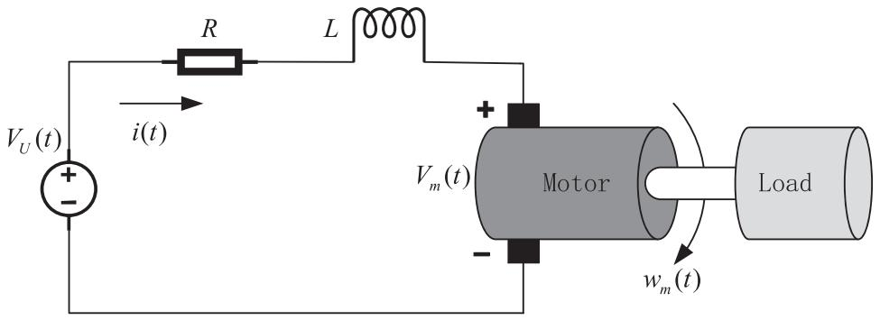

*Fig. 1. The DC motor device.*

From (9) we know that Y is an invertible matrix. Set ${ \bar { Y } } = Y ^ { - 1 }$ . Then, (37) can be guaranteed by

$$
\operatorname {d i a g} \{\bar {Y}, \bar {Y}, \bar {Y}, I, \bar {Y}, I, I \} \Gamma (i) \operatorname {d i a g} \{\bar {Y} ^ {T}, \bar {Y} ^ {T}, \bar {Y} ^ {T}, \bar {Y} ^ {T}, I, \bar {Y} ^ {T}, I, I \} <   0. \tag {38}
$$

By (35), we can obtain $\bar { K } _ { i } = K _ { i } \bar { Y } ^ { T }$ and $\bar { \Lambda } _ { i } = \bar { Y } \Lambda _ { i } \bar { Y } ^ { T }$ . Set further

$$
\bar {U} = \bar {Y} U \bar {Y} ^ {T}, \bar {P} _ {i} = \bar {Y} P _ {i} \bar {Y} ^ {T}, \bar {Q} _ {z} = \bar {Y} Q _ {z} \bar {Y} ^ {T} (z = 1, 2, 3),
$$

$$
\bar {G} _ {n} = \bar {Y} G _ {n} \bar {Y} ^ {T} (n = 1, 2, 3, 4), \bar {H} _ {m} = \bar {Y} H _ {m} \bar {Y} ^ {T} (m = 1, 2, 3, 4, 5).
$$

Then, (38) can be rewritten as $\bar { \Psi } ( i ) < 0$ when $\Upsilon _ { 1 } = 0$ . In the case when $\Upsilon _ { 1 } < 0$ , (38) can be equivalently transformed into $\left[ \begin{array} { l l } { \bar { \Psi } ( i ) } & { \quad \tilde { Y } _ { 1 } } \\ { * } & { \quad \Upsilon _ { 1 } ^ { - 1 } } \end{array} \right] < 0$ by using Schur鈥檚 complement again. In this way, we have shown that (30) implies (9). In a similar way to the proof above, we can prove that (31)鈥?34) imply (10)鈥?13), respectively, and we complete the proof. -

Remark 6. The theorem gives an efficient method for solving the extended dissipativity stabilization issue. Based on the analysis result in Theorem 1 and some equivalent transformations of matrix inequalities, a condition is developed in the form of a set of LMIs, which can be readily verified by available MATLAB YALMIP or LMI toolbox. When the condition holds true, the needed feedback-gain and event-triggered matrices are able to be achieved simultaneously.

# 4. Numerical examples

We use the DC model in [36,37] and the robot arm model in [38] to illustrate the validity of the designed MDSETM-based controller.

## Example 1

The DC motor model of [36,37], depicted in Fig. 1, can be characterized as

$$
\left\{ \begin{array}{l} V _ {m} (t) = K _ {b} w _ {m} (t), \\ V _ {U} (t) = L \frac {d i (t)}{d t} + R i (t) + V _ {m} (t), \\ T (t) = K _ {m} i (t), \\ J _ {m} \frac {d w _ {m} (t)}{d t} = - K _ {f} w _ {m} (t) + T (t), \end{array} \right.
$$

where $V _ { m } ( t )$ denotes the electrical voltage, $K _ { b }$ is a scalar corresponding to certain physical properties, $w _ { m } ( t )$ represents the angular velocity of the load, L and R, respectively, means the inductance and the resistance, i(t) represents the current, T (t ) denotes the torque at the DC motor shaft, $K _ { m }$ stands for the armature constant, $J _ { m }$ is the inertial load, and $K _ { f } w _ { m } ( t )$ represents a linear approximation of the viscous friction.

After some computation, the DC motor model can be expressed as

$$
\dot {x} (t) = \left(A _ {i} + \Delta A _ {i}\right) x (t) + B _ {i} u (t) + C _ {i} \varpi (t),
$$

where $i \in \{ 1 , 2 , 3 \} , x ( t ) = \left[ w _ { m } ( t ) , i ( t ) \right] ^ { T }$ and

$$
A _ {i} = \left[ \begin{array}{c c} a _ {i} ^ {1 1} & a _ {i} ^ {1 2} \\ a _ {i} ^ {2 1} & a _ {i} ^ {2 2} \end{array} \right], B _ {i} = \left[ \begin{array}{c c} b _ {i} ^ {1 1} & 0 \\ 0 & b _ {i} ^ {2 2} \end{array} \right].
$$

As in [36,37], the motor has three modes, namely normal, low, and medium modes; parameters $a _ { i } ^ { 1 1 } , a _ { i } ^ { 1 2 } , a _ { i } ^ { 2 1 } , a _ { i } ^ { 2 2 } , b _ { i } ^ { 1 1 }$ , and $b _ { i } ^ { 2 2 }$ are presented in Table 1; the other mode-dependent parameters are listed below:

$$
E _ {1} = E _ {2} = E _ {3} = \left[ \begin{array}{c} 0. 1 \\ 0. 1 \end{array} \right], F _ {1} = F _ {2} = F _ {3} = \left[ \begin{array}{c c} 0. 1 & 0. 1 \end{array} \right],
$$

**Table 1. Parameters of the DC motor.**

<table><tr><td>Mode</td><td>a11</td><td>a12</td><td>a21</td><td>a22</td><td>b11</td><td>b22</td></tr><tr><td>i=1</td><td>-0.479908</td><td>5.1546</td><td>-3.81625</td><td>14.4723</td><td>5.8705212</td><td>15.50107</td></tr><tr><td>i=2</td><td>-1.60261</td><td>9.1632</td><td>-0.5918697</td><td>3.0317</td><td>10.285129</td><td>2.2282663</td></tr><tr><td>i=3</td><td>0.634617</td><td>0.917836</td><td>-0.50569</td><td>2.48116</td><td>0.7874647</td><td>1.5302844</td></tr></table>

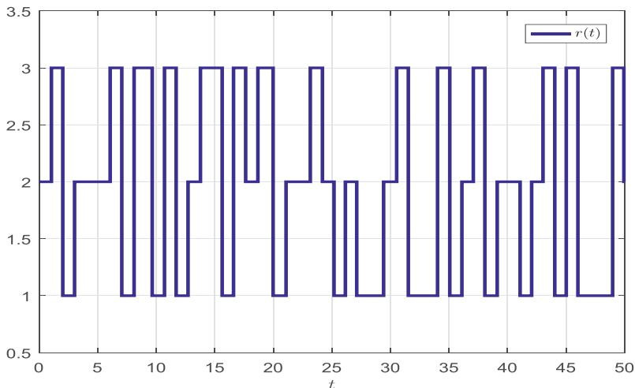

*Fig. 2. The switching signal of Example 1.*

$$
C _ {1} = \left[ \begin{array}{c c} 0. 1 & 0 \\ 0. 1 & 0. 1 \end{array} \right], C _ {2} = \left[ \begin{array}{c c} 0. 1 2 & 0. 1 \\ 0 & 0. 1 \end{array} \right], C _ {3} = \left[ \begin{array}{c c} 0. 1 & 0 \\ 0 & 0. 1 4 \end{array} \right].
$$

Note that $( \bar { A } _ { 1 } , B _ { 1 } )$ , $( \bar { A } _ { 2 } , B _ { 2 } )$ and $( \bar { A } _ { 3 } , B _ { 3 } )$ are controllable. Suppose that the switching is subjected to a semi-Markov process, where the sojourn time obeys the Weibull distribution when $i = 1 , 2$ and the exponential distribution when $i = 3$ . To be more specific, we choose transition rate function $\lambda _ { i } ( \iota ) = ( \beta _ { 2 } / \beta _ { 1 } \beta _ { 2 } ) \iota ^ { \beta _ { 2 } - 1 }$ for mode i, in which $\beta _ { 1 }$ and $\beta _ { 2 }$ are the scale and shape parameters, respectively. Herein, we set $\beta _ { 1 } = 1$ and $\beta _ { 2 } = 2$ for $i = 1$ and $\beta _ { 1 } = 1$ and $\beta _ { 2 } = 3$ for $i = 2$ , and exponential distribution with parameter 0.5. The transition rate intensity $q _ { i j }$ is chosen as

$$
q _ {i j} = \left[ \begin{array}{c c c} 0 & 0. 5 & 0. 5 \\ 0. 2 & 0 & 0. 8 \\ 0. 8 & 0. 2 & 0 \end{array} \right].
$$

Correspondingly, we have

$$
\mathcal {E} \{\lambda (\iota) \} = \left[ \begin{array}{c c c} - 3. 5 4 5 & 1. 7 7 2 5 & 1. 7 7 2 5 \\ 1. 0 8 3 3 & - 5. 4 1 6 4 & 4. 3 3 3 2 \\ 3. 2 & 0. 8 & - 4 \end{array} \right].
$$

Set $\alpha = 0 . 1 , \delta = 0 . 1$ , $d = 0 . 0 5$ , $\sigma = 0 . 0 1$ , $\varepsilon _ { 1 } = 0 . 0 3$ , $\varepsilon _ { 2 } = 0 . 0 1$ , the external disturbance $\boldsymbol { \varpi } \left( t \right) = \left[ e ^ { - t } , e ^ { - t } \right] ^ { T }$ , and the initial condition $x ( 0 ) = [ 0 ; 0 ]$ . The mode switching process is depicted in Fig. 2.

Next, consider the following four cases:

## Case 1. $\mathcal { H } _ { \infty }$ performance

Choose $\Upsilon _ { 1 } = - I , \Upsilon _ { 2 } = 0 , \Upsilon _ { 3 } = 5 ^ { 2 } I ,$ $\Upsilon _ { 3 } = 5 ^ { 2 } I ,$ and $\Upsilon _ { 4 } = 0$ . Then, by solving LMIs (30)鈥?34) in Theorem 2 via the SeDuMi solver under the YALMIP interface in MATLAB, we can obtain

$$
K _ {1} = \left[ \begin{array}{c c} - 0. 7 5 2 3 & - 0. 3 7 0 2 \\ 0. 2 0 2 6 & - 1. 5 2 0 0 \end{array} \right], K _ {2} = \left[ \begin{array}{c c} - 0. 3 6 7 8 & - 0. 3 3 0 7 \\ 0. 4 3 9 8 & - 6. 5 6 5 1 \end{array} \right], K _ {3} = \left[ \begin{array}{c c} - 5. 8 1 1 1 & - 1. 7 7 5 9 \\ 0. 7 9 3 1 & - 9. 4 9 8 3 \end{array} \right],
$$

$$
\Lambda_ {1} = \left[ \begin{array}{c c} 3. 3 9 0 4 & - 6. 1 0 9 9 \\ - 6. 1 0 9 9 & 4 2. 1 9 1 9 \end{array} \right], \Lambda_ {2} = \left[ \begin{array}{c c} 2. 4 3 7 2 & - 1. 6 6 1 9 \\ - 1. 6 6 1 9 & 2 2. 7 8 5 4 \end{array} \right], \Lambda_ {3} = \left[ \begin{array}{c c} 2. 7 6 3 7 & - 2. 1 6 4 9 \\ - 2. 1 6 4 9 & 2 2. 4 9 7 2 \end{array} \right].
$$

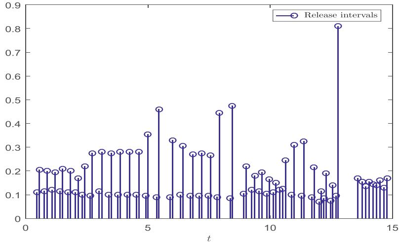

*Fig. 3. Release intervals and instants of the MDSETM in Case 1 of Example 1.*

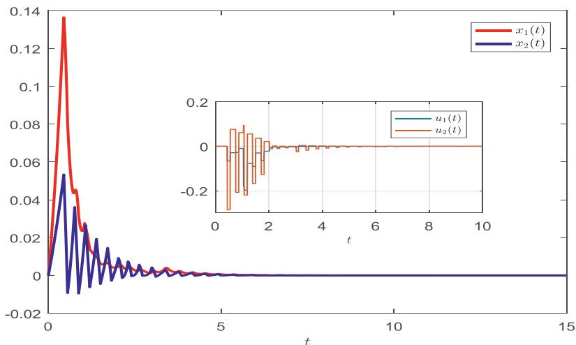

*Fig. 4. State trajectories with control in Case 1 of Example 1.*

**Table 2. Comparison of the NTEs under different ETMs in Case 1 of Example 1.**

<table><tr><td>Mechanism</td><td>The NTEs</td><td>Transmission rate (%)</td></tr><tr><td>PSM in [45]</td><td>300</td><td>100</td></tr><tr><td>STEM in [29]</td><td>175</td><td>58</td></tr><tr><td>STEM in [44]</td><td>97</td><td>32</td></tr><tr><td>MDSETM</td><td>82</td><td>27</td></tr></table>

Figure 3 depicts the event-triggered release intervals and instants based on the proposed MDSETM. Figure 4 exhibits state trajectories of the SCLS. We can find that the system achieves stability under the designed MDSETM-based controller. Define

$$
\bar {H} (t) = \frac {\int_ {0} ^ {t} x ^ {T} (\mu) x (\mu) d \mu}{\int_ {0} ^ {t} \varpi^ {T} (\mu) \varpi (\mu) d \mu},
$$

which corresponds to the square of the $\mathcal { H } _ { \infty }$ performance index when $t \to \infty$ . Then, the evolution of $\bar { H } ( t )$ with the zeroinitial condition is depicted in Fig. 5. It is found that $\bar { H } ( t )$ converges eventually to 0.0112, which is less than predefined $\mathcal { H } _ { \infty }$ performance level. Hence, the simulations confirm the validity of the present the MDSETM-based control method for Case 1.

Table 2 provides a comparison of the NTEs under different ETMs. As shown in the table, the NTEs based on the present the MDSETM is $7 3 \%$ less than that based on the PSM in [45], $3 1 \%$ less than that based on the STEM in [29], and $5 \%$ less than that based on the STEM in [44].

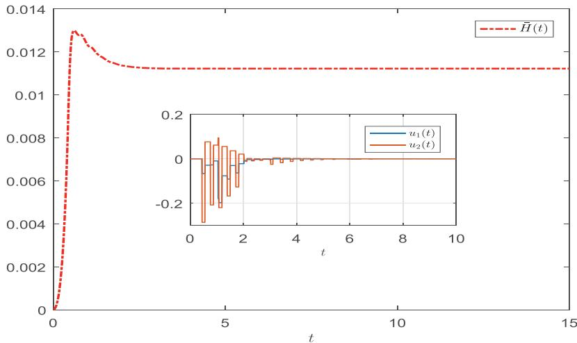

*Fig. 5. The trajectory of ${ \bar { H } } ( t )$ .*

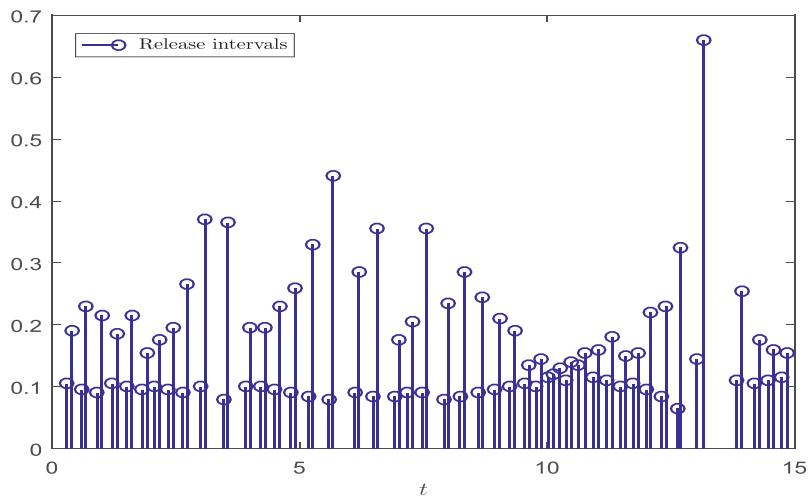

*Fig. 6. Release intervals and instants of the MDSETM in Case 2 of Example 1.*

## Case 2. $\mathcal { L } _ { 2 } - \mathcal { L } _ { \infty }$ performance

Choose $\Upsilon _ { 1 } = 0$ , $\Upsilon _ { 2 } = 0$ , $\Upsilon _ { 3 } = 5 . 7 ^ { 2 } I$ , and $\Upsilon _ { 4 } = I .$ Then, by solving LMIs (30)鈥?34) in Theorem 2 via the SeDuMi solver under the YALMIP interface in MATLAB, we can obtain

$$
K _ {1} = \left[ \begin{array}{c c} - 1. 4 0 7 7 & - 0. 4 5 6 1 \\ 0. 1 0 7 6 & - 1. 5 8 1 5 \end{array} \right], K _ {2} = \left[ \begin{array}{c c} - 0. 7 7 6 1 & - 0. 3 6 2 5 \\ 0. 1 6 8 3 & - 7. 3 3 5 6 \end{array} \right], K _ {3} = \left[ \begin{array}{c c} - 1 0. 9 1 3 1 & - 1. 3 4 3 5 \\ 0. 4 5 0 8 & - 1 0. 4 9 6 5 \end{array} \right],
$$

$$
\Lambda_ {1} = \left[ \begin{array}{c c} 1 4. 0 6 9 1 & - 5. 8 6 4 1 \\ - 5. 8 6 4 1 & 6 7. 3 3 4 2 \end{array} \right], \Lambda_ {2} = \left[ \begin{array}{c c} 1 3. 3 0 6 4 & - 1. 3 1 6 9 \\ - 1. 3 1 6 9 & 4 3. 2 1 2 0 \end{array} \right], \Lambda_ {3} = \left[ \begin{array}{c c} 1 3. 5 8 0 3 & - 2. 6 0 1 9 \\ - 2. 6 0 1 9 & 4 1. 1 6 2 2 \end{array} \right].
$$

Figure 6 depicts the event-triggered release intervals and instants based on the proposed mechanism. Figure 7 exhibits state trajectories of the SCLS. We can find that the system achieves stability under the designed MDSETM-based controller. Define

$$
\bar {L} (t) = \frac {\sup _ {t \geq 0} x ^ {T} (t) x (t)}{\int_ {0} ^ {t} \varpi^ {T} (\mu) \varpi (\mu) d \mu},
$$

which corresponds to the square of the $\mathcal { L } _ { 2 } - \mathcal { L } _ { \infty }$ performance index when $t \to \infty$ . Then, the trajectory of $\bar { L } ( t )$ with the zero-initial condition is depicted in Fig. 8. It is found that ${ \bar { L } } ( t )$ converges eventually to 0, which is less than predefined $\mathcal { L } _ { 2 } - \mathcal { L } _ { \infty }$ performance level. Hence, the simulations confirm the validity of the present the MDSETM-based control method for Case 2.

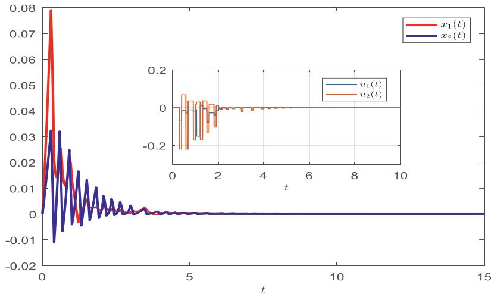

*Fig. 7. State trajectories with control in Case 2 of Example 1.*

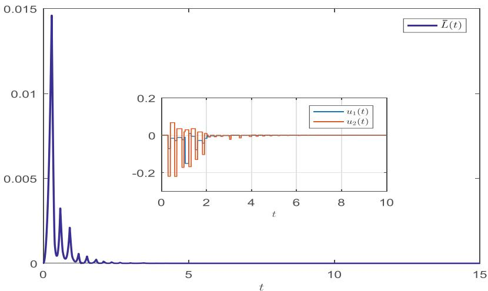

*Fig. 8. The trajectory of L炉(t ).*

**Table 3. Comparison of the NTEs under different ETMs in Case 2 of Example 1 .**

<table><tr><td>Mechanism</td><td>The NTEs</td><td>Transmission rate (%)</td></tr><tr><td>PSM in [45]</td><td>300</td><td>100</td></tr><tr><td>STEM in [29]</td><td>169</td><td>56</td></tr><tr><td>STEM in [44]</td><td>102</td><td>34</td></tr><tr><td>MDSETM</td><td>91</td><td>30</td></tr></table>

Table 3 provides a comparison of the NTEs under different ETMs. As shown in the table, the NTEs based on the present the MDSETM is $7 0 \%$ less than that based on the periodic sampling mechanism (PSM) in [45], $2 6 \%$ less than that based on the STEM in [29], and $4 \%$ less than that based on the STEM in [44].

## Cases 3 and 4. Passive and $( { \mathcal { Q } } , { \mathcal { S } } , { \mathcal { R } } )$ - dissipative performances

Choose $\Upsilon _ { 1 } = 0$ , $\Upsilon _ { 2 } = I$ , $\Upsilon _ { 3 } = 4 . 8 ^ { 2 } I$ , $\Upsilon _ { 4 } = 0$ and $\Upsilon _ { 1 } = - I ,$ , $\Upsilon _ { 2 } = I$ , $\Upsilon _ { 3 } = 3 . 8 I$ , $\Upsilon _ { 4 } = 0$ , respectively. Solve LMIs (30)鈥?34) in Theorem 2 resulting in

$$
K _ {1} = \left[ \begin{array}{c c} - 0. 3 3 8 5 & 0. 0 4 6 6 \\ 0. 2 7 2 4 & - 1. 4 2 8 2 \end{array} \right], K _ {2} = \left[ \begin{array}{c c} - 0. 1 3 1 5 & - 0. 2 5 4 5 \\ 0. 8 2 2 7 & - 5. 6 4 8 2 \end{array} \right], K _ {3} = \left[ \begin{array}{c c} - 2. 6 1 9 3 & 0. 0 2 9 9 \\ 1. 3 2 3 9 & - 8. 4 8 5 9 \end{array} \right],
$$

$$
\Lambda_ {1} = \left[ \begin{array}{c c} 1. 0 5 2 9 & - 4. 0 9 0 5 \\ - 4. 0 9 0 5 & 2 0. 6 5 2 9 \end{array} \right], \Lambda_ {2} = \left[ \begin{array}{c c} 0. 4 5 3 4 & - 1. 5 2 5 5 \\ - 1. 5 2 5 5 & 9. 8 6 2 4 \end{array} \right], \Lambda_ {3} = \left[ \begin{array}{c c} 0. 4 9 8 1 & - 1. 5 8 9 8 \\ - 1. 5 8 9 8 & 9. 7 6 2 2 \end{array} \right].
$$

for passivity and

$$
K _ {1} = \left[ \begin{array}{c c} - 0. 4 6 6 3 & - 0. 1 4 6 4 \\ 0. 2 5 7 1 & - 1. 4 6 6 8 \end{array} \right], K _ {2} = \left[ \begin{array}{c c} - 0. 2 1 1 0 & - 0. 2 5 5 8 \\ 0. 8 0 2 7 & - 6. 1 5 6 8 \end{array} \right], K _ {3} = \left[ \begin{array}{c c} - 3. 6 7 1 3 & - 0. 6 3 7 4 \\ 1. 2 4 8 9 & - 9. 0 3 6 4 \end{array} \right],
$$

$$
\Lambda_ {1} = \left[ \begin{array}{c c} 1 1. 2 1 4 8 & - 3 6. 5 1 0 3 \\ - 3 6. 5 1 0 3 & 1 9 6. 7 0 6 5 \end{array} \right], \Lambda_ {2} = \left[ \begin{array}{c c} 6. 1 7 8 1 & - 1 4. 7 5 6 6 \\ - 1 4. 7 5 6 6 & 1 0 4. 6 3 7 5 \end{array} \right], \Lambda_ {3} = \left[ \begin{array}{c c} 6. 7 3 1 7 & - 1 5. 2 8 8 8 \\ - 1 5. 2 8 8 8 & 1 0 1. 5 7 3 8 \end{array} \right].
$$

for $( { \mathcal { Q } } , { \mathcal { S } } , { \mathcal { R } } )$ - dissipativity. Based on the above feedback-gain and event-triggered matrices, the expected performances of the SCLS can be guaranteed. The simulations are omitted for the sake of brevity.

## Example 2

Consider the 2-degree-of-freedom (2-DOF) robot arm model in [38]. The dynamics of the model is given by

$$
F (\vartheta) + M (\vartheta) \ddot {\vartheta} + N (\vartheta , \dot {\vartheta}) \dot {\vartheta} = \tau^ {*}, \tag {39}
$$

where $F ( \vartheta ) , M ( \vartheta )$ , and $N ( \vartheta , \dot { \vartheta } )$ denote the gravity term, the mass matrix, and the Coriolis and centrifugal term, respectively. To be more specific,

$$
\vartheta = [ \vartheta_ {1}, \vartheta_ {2} ] ^ {T}, M (\vartheta) = \left[ \begin{array}{c c} M _ {1 1} (\vartheta) & M _ {1 2} (\vartheta) \\ M _ {2 1} (\vartheta) & M _ {2 2} (\vartheta) \end{array} \right],
$$

$$
F (\vartheta) = \left[ \begin{array}{c} F _ {1} (\vartheta) \\ F _ {2} (\vartheta) \end{array} \right], N (\vartheta , \dot {\vartheta}) = \left[ \begin{array}{c} N _ {1} (\vartheta , \dot {\vartheta}) \\ N _ {2} (\vartheta , \dot {\vartheta}) \end{array} \right]
$$

with

$$
M _ {1 1} (\vartheta) = m _ {1} f _ {1} ^ {2} + m _ {2} \left(f _ {1} ^ {2} + 2 f _ {1} f _ {2} \cos \vartheta_ {2} + f _ {2} ^ {2}\right),
$$

$$
M _ {1 2} (\vartheta) = m _ {2} \left(f _ {1} f _ {2} \cos \vartheta_ {2}\right) + f _ {2} ^ {2},
$$

$$
M _ {2 1} (\vartheta) = M _ {1 2} (\vartheta), M _ {2 2} (\vartheta) = m _ {2} f _ {2} ^ {2},
$$

$$
N _ {1} (\vartheta , \dot {\vartheta}) = - m _ {2} \left(f _ {1} f _ {2} \sin \vartheta_ {2} \left(2 \dot {\vartheta} _ {1} \dot {\vartheta} _ {2} + \dot {\vartheta} _ {2} ^ {2}\right)\right),
$$

$$
N _ {2} (\vartheta , \dot {\vartheta}) = m _ {2} f _ {1} f _ {2} \dot {\vartheta} _ {1} ^ {2} \sin \vartheta_ {2},
$$

$$
F _ {1} (\vartheta) = \left(m _ {1} + m _ {2}\right) f _ {1} g \cos \vartheta_ {1} + m _ {2} g f _ {2} \cos \left(\vartheta_ {1} + \vartheta_ {2}\right),
$$

$$
F _ {2} (\vartheta) = m _ {2} g f _ {2} \cos (\vartheta_ {1} + \vartheta_ {2}).
$$

Considering parametric uncertainty and extend disturbance, the linear model of (39) can be described by

$$
\dot {x} (t) = \left(A _ {i} + \Delta A _ {i}\right) x (t) + B _ {i} u (t) + C _ {i} \varpi (t),
$$

where

$$
\dot {\boldsymbol {x}} = \left[ \begin{array}{c c c} \vartheta_ {1}, & \vartheta_ {2}, & \dot {\vartheta} _ {1}, \\ & & \dot {\vartheta} _ {2} \end{array} \right] ^ {T}, u (t) = \tau^ {*},
$$

$$
A _ {1} = \left[ \begin{array}{c c c c} 0 & 0 & 1 & 0 \\ 0 & 0 & 0 & 1 \\ a (i) _ {1} & a (i) _ {2} & 0 & 0 \\ a (i) _ {3} & a (i) _ {4} & 0 & 0 \end{array} \right], B _ {i} = \left[ \begin{array}{c c} b _ {i} ^ {1} & b (i) _ {2} \\ b _ {i} ^ {3} & b _ {i} ^ {4} \end{array} \right]
$$

with

$$
\begin{array}{l} a (i) _ {1} = - \frac {g f _ {2} m _ {2 i} \left(m _ {1 i} f _ {1} ^ {2} + f _ {1} ^ {2} m _ {2 i} + m _ {2 i} f _ {2} ^ {2} + 2 f _ {1} f _ {2} m _ {2 i}\right)}{m _ {1 i} f _ {1} ^ {2} m _ {2 i} f _ {2} ^ {2}} \\ - \frac {g f _ {2} m _ {2 i} \left(f _ {1} + f _ {2}\right) \left(m _ {1 i} f _ {1} + f _ {1} m _ {2 i} + m _ {2 i} f _ {2}\right)}{m _ {1 i} f _ {1} ^ {2} m _ {2 i} f _ {2} ^ {2}}, \\ \end{array}
$$

$$
\begin{array}{l} a (i) _ {2} = - \frac {g f _ {2} m _ {2 i} \left(m _ {1 i} f _ {1} ^ {2} + f _ {1} ^ {2} m _ {2 i} + m _ {2 i} f _ {2} ^ {2} + 2 f _ {1} f _ {2} m _ {2 i}\right)}{m _ {1 i} f _ {1} ^ {2} m _ {2 i} f _ {2} ^ {2}} \\ - \frac {g m _ {2 i} ^ {2} f _ {2} ^ {2} (f _ {1} + f _ {2})}{m _ {1 i} f _ {1} ^ {2} m _ {2 i} f _ {2} ^ {2}}, \\ \end{array}
$$

$$
a (i) _ {3} = \frac {g \left(f _ {2} + f _ {1} m _ {2 i}\right)}{m _ {1 i} f _ {1} ^ {2} - m _ {2 i} f _ {2} ^ {2} g \left(f _ {1} m _ {1 i} + f _ {1} m _ {2 i} + f _ {2} m _ {2 i}\right)},
$$

$$
a (i) _ {4} = \frac {g \left(f _ {2} + f _ {1} m _ {2 i}\right)}{m _ {1 i} f _ {1} ^ {2} - g f _ {2} m _ {2 i} f _ {2} ^ {2} m _ {2 i}},
$$

$$
b (i) _ {1} = \frac {f _ {1} + f _ {2}}{f _ {2} m _ {1 i} f _ {1} ^ {2}},
$$

$$
b (i) _ {2} = \frac {m _ {1 i} f _ {1} ^ {2} + f _ {1} ^ {2} m _ {2 i} + m _ {2 i} f _ {2} ^ {2} + 2 f _ {1} l _ {2} m _ {2 i}}{m _ {1 i} f _ {1} ^ {2} m _ {2 i} f _ {2} ^ {2}}
$$

$$
b (i) _ {3} = m _ {2 i} f _ {2} ^ {2},
$$

$$
b (i) _ {4} = - \frac {f _ {2} + f _ {1} m _ {2 i}}{m _ {1 i} f _ {1} ^ {2} m _ {2 i} f _ {2} ^ {2}},
$$

$$
Z _ {1 1} = m _ {1 1} f _ {1} ^ {2}, Z _ {2 1} = m _ {2 1} f _ {1} ^ {2}, Z _ {1 2} = m _ {1 2} f _ {2} ^ {2}, Z _ {2 2} = m _ {2 2} f _ {2} ^ {2}.
$$

The following parameters are taken from [38]:

$$
g = 9. 8 m / s ^ {2}, f _ {1} = 0. 4 m, f _ {2} = 0. 2 m,
$$

$$
Z _ {1 1} = 0. 2 5 N * m, Z _ {2 1} = 0. 1 N * m,
$$

$$
Z _ {1 2} = 0. 4 N * m, Z _ {2 2} = 0. 2 N * m,
$$

$$
m _ {1 1} = 0. 5 k g, m _ {2 1} = 0. 3 k g,
$$

$$
m _ {1 2} = 0. 8 k g, m _ {2 2} = 0. 5 k g.
$$

The switch between different speeds depends on $\{ \varsigma ( t ) , t \ge 0 \}$ taking values in $\bar { N } = \{ 1 , 2 \}$ . The other parameters are taken as follows:

$$
C _ {1} = \left[ \begin{array}{c c c c} - 0. 5 & 0 & 0 & 0 \\ 0 & 1 & - 1 & 0 \\ 0 & 0 & - 1 & 0 \\ 0 & 0 & 0 & 0. 5 \end{array} \right], C _ {2} = \left[ \begin{array}{c c c c} - 1. 8 & 0 & 0 & 0 \\ 0 & 0. 3 & 0 & 0. 1 \\ 0 & 0 & 0. 3 & 0 \\ 0 & 0 & 0 & 0. 8 \end{array} \right].
$$

We assume that the sojourn time follows the Weibull distribution. To be more specific, we choose transition rate function $\lambda _ { i } ( \iota ) = ( \beta _ { 2 } / \beta _ { 1 } \beta _ { 2 } ) \iota ^ { \beta _ { 2 } - 1 }$ for mode i, in which $\beta _ { 1 }$ and $\beta _ { 2 }$ are the scale and shape parameters, respectively. Herein, we set $\beta _ { 1 } = 1$ and $\beta _ { 2 } = 2$ for $i = 1$ and $\beta _ { 1 } = 1$ and $\beta _ { 2 } = 3$ for $i = 2$ , which implies that

$$
\left(\lambda_ {i j} (\iota)\right) _ {2 \times 2} = \left[ \begin{array}{c c} - 2 \iota & 2 \iota \\ 3 \iota^ {2} & - 3 \iota^ {2} \end{array} \right].
$$

Correspondingly, we have

$$
\mathcal {E} \{\lambda (\iota) \} = \left[ \begin{array}{c c} - 1. 7 7 2 5 & 1. 7 7 2 5 \\ 2. 7 0 8 2 & - 2. 7 0 8 2 \end{array} \right].
$$

We set $\alpha = 0 . 1$ , $\delta = 0 . 1$ , $d = 0 . 0 5$ , $\sigma = 0 . 0 0 1$ , $\varepsilon _ { 1 } = 0 . 0 3$ , $\varepsilon _ { 2 } = 0 . 0 1$ , the external disturbance $\varpi ( t ) =$ $\left[ 5 e ^ { - t } , 1 0 e ^ { - t } , 1 0 e ^ { - t } , 1 0 e ^ { - t } \right] ^ { T }$ , and the initial condition $\begin{array} { r } { x ( 0 ) = \bigl [ - \frac { \pi } { 2 } ; - \frac { \pi } { 2 } ; 0 ; 0 \bigr ] . } \end{array}$ . The mode switching is exhibited in Fig. 9. In what follows, for brevity, we only consider two cases of the extended dissipativity.

## Case 1. Passvie performance

Choose $\Upsilon _ { 1 } = 0$ , 蠏 = I, 蠏 = 6.52I, and $\Upsilon _ { 4 } = 0$ . Then, by solving LMIs (30)鈥?34) in Theorem 2 via the SeDuMi solver under the YALMIP interface in MATLAB, we can obtain

$$
K _ {1} = \left[ \begin{array}{c c c c} - 3. 1 8 8 8 & 2. 6 0 6 5 & 0. 7 1 5 9 & 1. 5 6 6 7 \\ - 2. 1 2 7 3 & 2. 7 2 0 1 & - 0. 0 8 8 7 & 1. 0 6 4 8 \end{array} \right],
$$

$$
K _ {2} = \left[ \begin{array}{c c c c} - 1. 3 8 8 6 & 6. 8 1 1 6 & 1. 1 0 3 2 & 2. 8 9 4 9 \\ - 1. 1 5 4 7 & 7. 2 3 3 2 & - 0. 0 8 3 1 & 2. 3 8 5 2 \end{array} \right],
$$

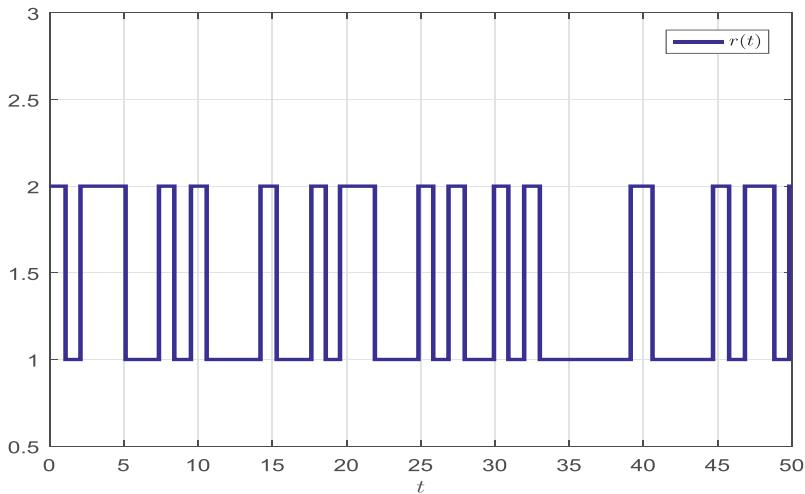

*Fig. 9. The switching signal of Example 2.*

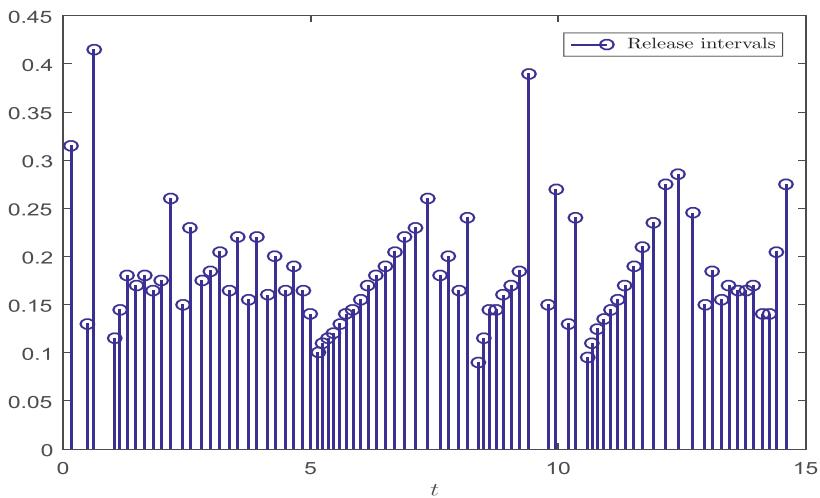

*Fig. 10. Release intervals and instants of the MDSETM in Case 1 of Example 2.*

$$
\Lambda_ {1} = \left[ \begin{array}{c c c c} 4. 1 7 1 6 & - 0. 7 6 3 0 & 0. 3 9 3 5 & - 0. 1 3 7 8 \\ - 0. 7 6 3 0 & 4. 6 0 6 8 & - 0. 1 2 8 0 & 0. 5 1 1 4 \\ 0. 3 9 3 5 & - 0. 1 2 8 0 & 0. 0 8 5 0 & - 0. 0 0 5 6 \\ - 0. 1 3 7 8 & 0. 5 1 1 4 & - 0. 0 0 5 6 & 0. 0 8 8 4 \end{array} \right],
$$

$$
\Lambda_ {2} = \left[ \begin{array}{c c c c} 2. 8 7 5 6 & - 0. 3 9 1 7 & 0. 2 9 7 7 & - 0. 0 5 2 2 \\ - 0. 3 9 1 7 & 4. 1 0 1 5 & - 0. 0 9 5 1 & 0. 4 5 3 3 \\ 0. 2 9 7 7 & - 0. 0 9 5 1 & 0. 0 7 7 0 & - 0. 0 0 0 0 \\ - 0. 0 5 2 2 & 0. 4 5 3 3 & - 0. 0 0 0 0 & 0. 0 7 8 4 \end{array} \right].
$$

Figure 10 illustrates the event-triggered release intervals and instants under the presented MDSETM-based controller. Figure 11 describes the state trajectories under control input. It is clear that the SCLS achieves stability. Table 4 shows a comparison results of the NTEs under different ETMs. It can be found the NTEs under the MDSETM is $7 2 \%$ less than that under the PSM in [45], $6 5 \%$ less than that under the STEM in [29], and $5 \%$ less than that under the STEM in [44].

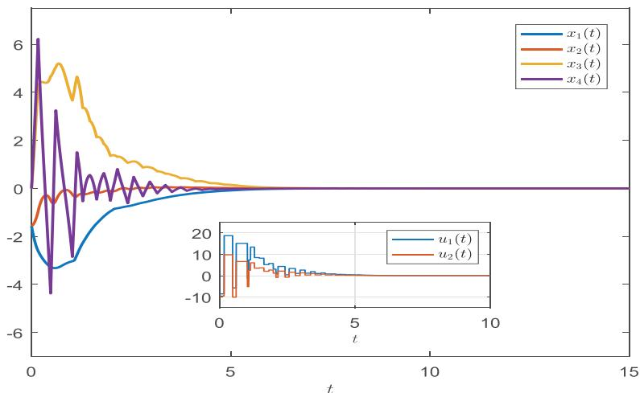

*Fig. 11. State trajectories with control in Case 1 of Example 2.*

**Table 4. Comparison of the NTEs under different ETMs in Case 1 of Example 2.**

<table><tr><td>Mechanism</td><td>The NTEs</td><td>Transmission rate (%)</td></tr><tr><td>PSM in [45]</td><td>300</td><td>100</td></tr><tr><td>STEM in [29]</td><td>280</td><td>93</td></tr><tr><td>STEM in [44]</td><td>100</td><td>33</td></tr><tr><td>MDSETM</td><td>83</td><td>28</td></tr></table>

## Case 2. $( { \mathcal { Q } } , { \mathcal { S } } , { \mathcal { R } } )$ - dissipative performances

Choose $\Upsilon _ { 1 } = - I , \Upsilon _ { 2 } = I , \Upsilon _ { 3 } = 6 . 5 I$ $\Upsilon _ { 3 } = 6 . 5 I$ , and $\Upsilon _ { 4 } = 0$ . Then, by solving LMIs (30)鈥?34) in Theorem 2 via the SeDuMi solver under the YALMIP interface in MATLAB, we can obtain

$$
\begin{array}{l} K _ {1} = \left[ \begin{array}{c c c c} - 3. 0 6 1 7 & 2. 0 1 2 8 & 0. 4 7 0 5 & 0. 9 6 7 1 \\ - 2. 2 3 2 6 & 2. 2 1 6 1 & - 0. 1 4 7 2 & 0. 6 0 3 9 \end{array} \right], \\ \Lambda_ {1} = \left[ \begin{array}{c c c c} 3 0 2. 9 5 1 9 & - 4 1. 1 9 1 2 & 4 9. 8 1 3 0 & - 1 4. 6 9 5 0 \\ - 4 1. 1 9 1 2 & 1 0 0. 2 9 7 6 & - 1 2. 0 1 9 0 & 1 9. 8 8 7 1 \\ 4 9. 8 1 3 0 & - 1 2. 0 1 9 0 & 1 3. 4 7 7 5 & - 1. 0 9 5 7 \\ - 1 4. 6 9 5 0 & 1 9. 8 8 7 1 & - 1. 0 9 5 7 & 6. 0 6 8 9 \end{array} \right], \\ K _ {2} = \left[ \begin{array}{c c c c} 0. 4 2 3 5 & 5. 2 1 7 0 & 1. 2 5 1 2 & 1. 5 8 9 0 \\ - 0. 7 1 6 5 & 5. 9 3 2 7 & 0. 1 3 8 9 & 1. 3 5 6 4 \end{array} \right], \\ \Lambda_ {2} = \left[ \begin{array}{c c c c} 2 4 7. 3 3 8 4 & - 2 4. 1 7 4 6 & 4 8. 2 8 1 4 & - 6. 8 0 4 1 \\ - 2 4. 1 7 4 6 & 1 1 9. 5 9 7 6 & - 1 2. 7 3 1 0 & 2 2. 4 1 9 3 \\ 4 8. 2 8 1 4 & - 1 2. 7 3 1 0 & 1 3. 1 8 0 4 & - 1. 5 8 0 9 \\ - 6. 8 0 4 1 & 2 2. 4 1 9 3 & - 1. 5 8 0 9 & 5. 5 6 0 8 \end{array} \right]. \\ \end{array}
$$

Figure 12 illustrates the event-triggered release intervals and instants under the designed MDSETM-based controller. Figure 13 describes the state trajectories under control input. Obviously, the SCLS quickly achieves stability. Hence, the simulations validate of the proposed control method. Table 5 shows a comparison results of the NTEs under different ETMs. We can see that the NTEs under the MDSETM is $5 1 \%$ less than that under the PSM in [45], $4 5 \%$ less than that under the STEM in [29], and $3 \%$ less than that under the STEM in [44].

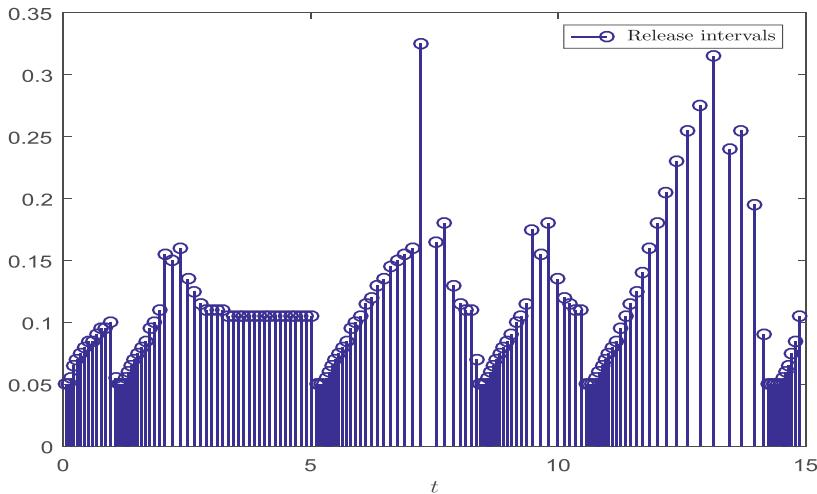

*Fig. 12. Release intervals and instants of the MDSETM in Case 2 of Example 2.*

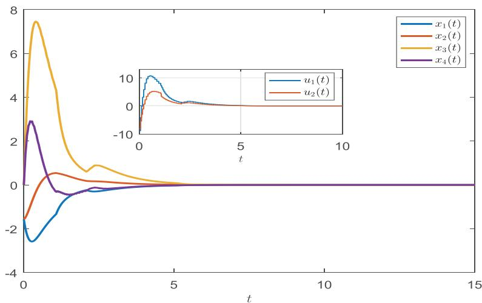

*Fig. 13. State trajectories with control in Case 2 of Example 2.*

**Table 5. Comparison of the NTEs under different ETMs in Case 2 of Example 2.**

<table><tr><td>Mechanism</td><td>The NTEs</td><td>Transmission rate (%)</td></tr><tr><td>PSM in [45]</td><td>300</td><td>100</td></tr><tr><td>STEM in [29]</td><td>281</td><td>94</td></tr><tr><td>STEM in [44]</td><td>157</td><td>52</td></tr><tr><td>MDSETM</td><td>147</td><td>49</td></tr></table>

# 5. Conclusion

The paper has addressed the extended stabilization problem for uncertain semi-MSSs with disturbances. A MDSETM has been devised to determine the triggered moments by introducing the mode-dependent event-triggered matrix and disturbance related term into the threshold function. By employing time- and mode-dependent piecewise-defined $V ( t )$ , a criterion for stochastic stability and extended dissipativity of semi-MSS (6) has been proposed in Theorem 1. On the basis of the criterion, a LMIs-based co-design of needed feedback-gain and event-triggered matrices has been developed in Theorem 2 via using some equivalent transformations of matrix inequalities. Finally, a DC motor model and 2-DOF robot arm model have been employed to illustrate the advantages of the MDSETM and validity of the proposed controller design method.

In this paper, the designed MDSETM is based on measurable disturbances. In the case when the disturbances are unmeasurable, one may first obtain the estimate of these disturbances via designing observer, and then use them in the ETM. This will be one of the directions of our future research.

