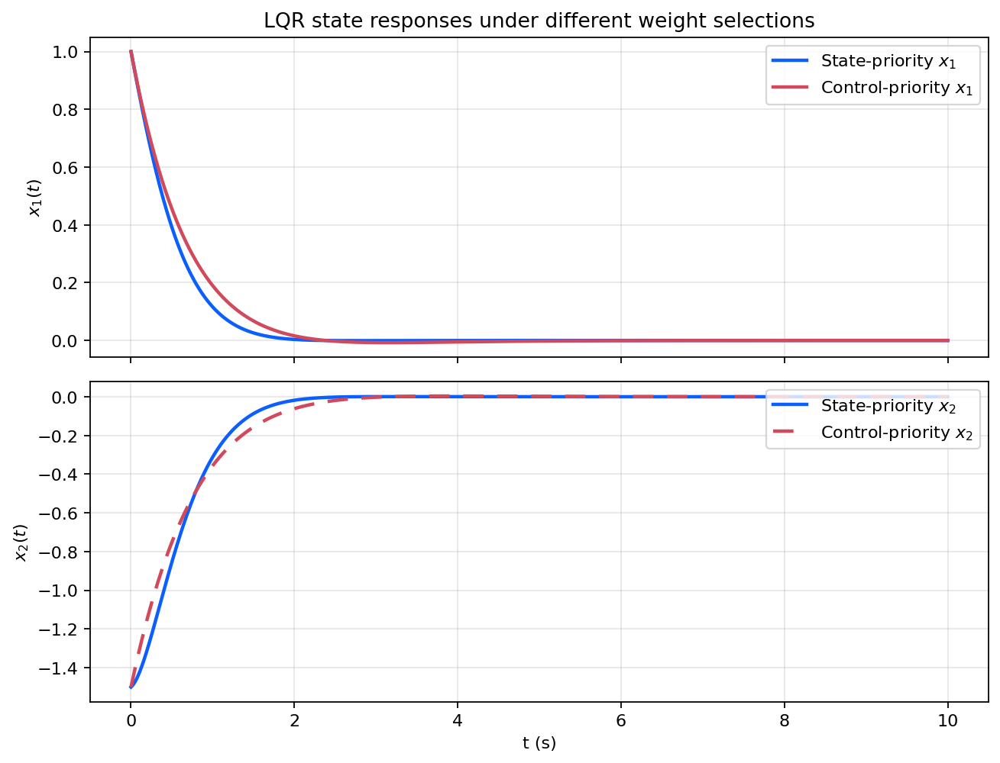
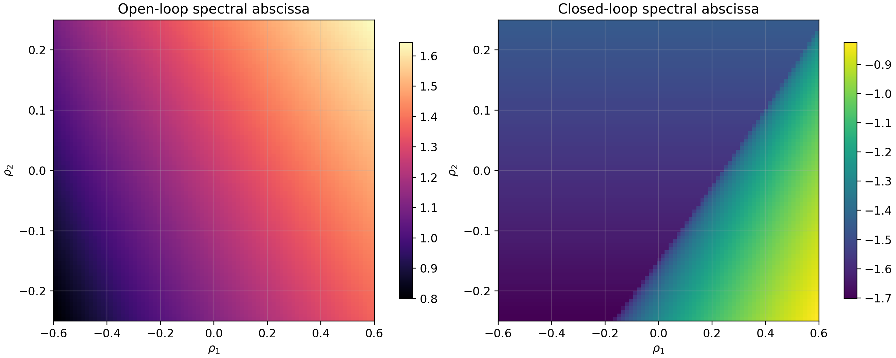
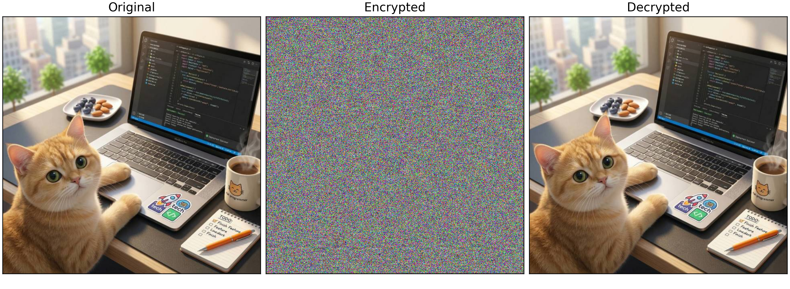

# 控制理论学习与实验

仓库整理了现代控制理论方向的一条中文主干学习线及配套数值实验。主阅读层位于 `notes/`，可复现实验位于 `experiments/`，同一主题下尽量同时保留 Python 和 MATLAB 版本，用于关联理论推导、状态空间模型和结果图像。

## 仓库导航

- [notes/README.md](notes/README.md)：章节顺序、主题概览和章节定位。
- [experiments/README.md](experiments/README.md)：实验索引、运行入口和目录速查。
- [figures/](figures/)：主笔记和实验 README 直接引用的图像结果。

## 学习主线

| 章节 | 主题 | 主要内容 | 实验入口 |
| --- | --- | --- | --- |
| [01](notes/01_系统建模与状态空间基础.md) | 系统建模与状态空间基础 | 从物理模型到状态空间表达、平衡点与矩阵指数响应 | [01 建模实验](experiments/foundations/01_state_space_modeling/README.md) |
| [02](notes/02_线性时不变系统稳定性.md) | 线性时不变系统稳定性 | 特征值判据与 Lyapunov 判据下的连续时间 LTI 稳定性 | [02 稳定性实验](experiments/foundations/02_lti_stability/README.md) |
| [03](notes/03_可控性与可观性.md) | 可控性与可观性 | Kalman 判据、PBH 判据、最小能量状态转移与状态重构 | [03 可控可观实验](experiments/foundations/03_controllability_observability/README.md) |
| [04](notes/04_线性时不变系统控制.md) | 线性时不变系统控制 | 状态反馈、输出反馈和 LMI 设计条件对应的可计算闭环响应 | [04 控制实验](experiments/foundations/04_lti_control/README.md) |
| [05](notes/05_观测器与分离原理.md) | 观测器与分离原理 | Luenberger 观测器、估计误差系统与分离原理 | [05 观测器实验](experiments/foundations/05_observer_and_separation/README.md) |
| [06](notes/06_最优控制.md) | 最优控制 | 连续时间 LQR、Riccati 方程与状态/能量折中 | [06 最优控制实验](experiments/foundations/06_optimal_control/README.md) |
| [07](notes/07_跟踪与抗扰.md) | 跟踪与抗扰 | 参考跟踪、积分增广与常值扰动抑制 | [07 跟踪抗扰实验](experiments/foundations/07_tracking_and_disturbance_rejection/README.md) |
| [08](notes/08_线性时不变系统周期采样控制与稳定性分析.md) | 周期采样控制 | 采样、零阶保持与连续状态响应之间的关系 | [08 采样控制实验](experiments/foundations/08_periodic_sampling_control/README.md) |
| [09](notes/09_鲁棒控制.md) | 鲁棒控制 | 区间不确定系统下名义模型与不确定模型的闭环表现比较 | [09 鲁棒控制实验](experiments/robust_control/09_robust_control/README.md) |
| [10](notes/10_非线性时滞神经网络稳定性.md) | 非线性时滞神经网络稳定性 | LMI 判据与时域仿真下的时滞收敛速度分析 | [10 时滞神经网络实验](experiments/nonlinear_and_delay/10_delay_neural_network_stability/README.md) |
| [11](notes/11_混沌时滞神经网络同步与图像加密.md) | 混沌同步与图像加密 | 同步控制结果与图像加密、解密流程 | [11 同步与加密实验](experiments/nonlinear_and_delay/11_chaotic_sync_and_image_encryption/README.md) |

## 结果速览

| 主线 | 代表结果 | 主要结论 |
| --- | --- | --- |
| 系统建模 | 阻尼振荡模型可直接写成二维状态空间系统 | 状态变量、平衡点和输入响应被放到同一套表达里 |
| LTI 稳定性 | 多组初值的状态轨迹都收敛到原点 | 谱判据和 Lyapunov 判据在同一二维系统上给出一致结论 |
| 可控与可观 | 最小能量控制把状态驱动到目标点，输出样本可恢复初始状态 | Kalman/PBH 判据与状态转移、状态重构直接对应 |
| LTI 控制 | 状态反馈和输出反馈都能把开环发散系统拉回稳定闭环 | 不同控制器结构下的时域响应可直接比较 |
| 观测器 | 估计误差快速衰减并支撑输出反馈闭环 | 分离原理允许反馈设计与状态估计分开处理 |
| 最优控制 | 两组 LQR 权重对应不同的收敛速度与控制峰值 | Riccati 方程把稳定化推进到性能折中设计 |
| 跟踪与抗扰 | 积分伺服能把扰动后的输出重新拉回参考值 | 零稳态误差依赖积分增广而非单纯状态反馈 |
| 周期采样控制 | 连续状态与采样状态保持一致的收敛趋势 | 采样保持与闭环更新的协同关系可用时滞结构分析 |
| 鲁棒控制 | 区间顶点的最坏频域增益估计约为 `0.47` | 同时覆盖名义模型与参数漂移条件下的稳定裕度 |
| 时滞神经网络 | 时滞增大时，状态收敛明显变慢 | LMI 判据和时域仿真能够互相印证 |
| 混沌同步与图像加密 | 同步误差快速压低并支撑后续图像加密流程 | 同步控制结果延伸到图像处理实验 |

## 精选展示

### 系统建模与状态空间基础

状态与输出响应图把物理模型、状态变量和时域结果放到同一条链路中。

<p align="center">
  
</p>

### 最优控制

LQR 权重变化对应不同的收敛速度与控制能量折中。

<p align="center">
  
</p>

### 鲁棒控制

参数区间扫描展示了名义闭环之外的稳定裕度。

<p align="center">
  
</p>

### 混沌同步与图像加密

同步控制和图像加密被放在同一条实验链路里验证。

<p align="center">
  
</p>

## 快速开始

Python 依赖见 [requirements.txt](requirements.txt)。以下命令在仓库根目录执行。

```bash
pip install -r requirements.txt
python experiments/foundations/01_state_space_modeling/generate_results.py
python experiments/foundations/06_optimal_control/generate_results.py
matlab -batch "run('experiments/nonlinear_and_delay/11_chaotic_sync_and_image_encryption/generate_results.m')"
```

图像默认写入 `figures/`，数值结果默认写入 `generated/`；`generated/` 只用于本地复现检查，不纳入版本控制。

## 仓库结构

```text
ControlTheory-Study-and-Experiments/
├─ notes/
│  ├─ README.md
│  ├─ 01_系统建模与状态空间基础.md
│  ├─ 02_线性时不变系统稳定性.md
│  ├─ 03_可控性与可观性.md
│  ├─ 04_线性时不变系统控制.md
│  ├─ 05_观测器与分离原理.md
│  ├─ 06_最优控制.md
│  ├─ 07_跟踪与抗扰.md
│  ├─ 08_线性时不变系统周期采样控制与稳定性分析.md
│  ├─ 09_鲁棒控制.md
│  ├─ 10_非线性时滞神经网络稳定性.md
│  └─ 11_混沌时滞神经网络同步与图像加密.md
├─ experiments/
│  ├─ README.md
│  ├─ foundations/
│  ├─ robust_control/
│  └─ nonlinear_and_delay/
├─ figures/
├─ generated/
├─ requirements.txt
├─ README.md
└─ LICENSE
```

## 开源协议

本仓库中的代码、笔记、图示与文档结构基于 [MIT License](LICENSE) 开源。数据、论文内容和第三方原始资料仍以各自原始许可和引用要求为准。
