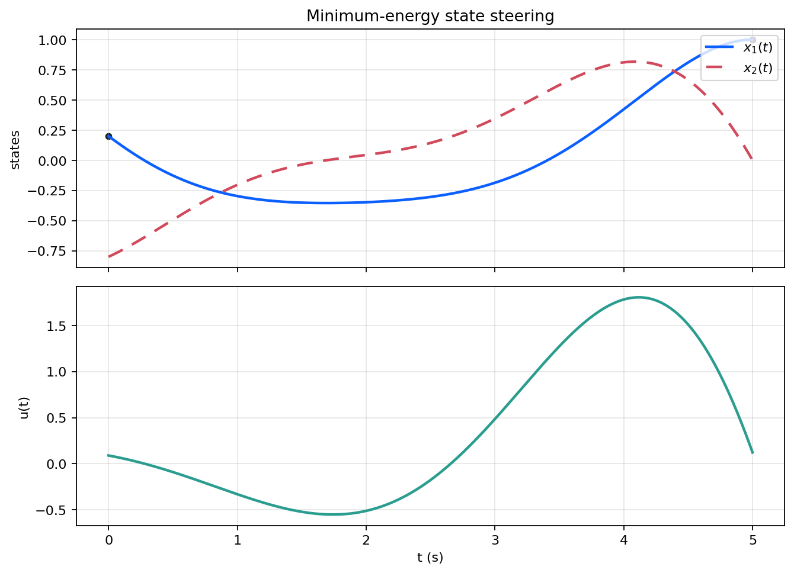

# 03 可控性与可观性实验

本目录复现 [`03_可控性与可观性`](../../../notes/03_可控性与可观性.md) 中的最小能量状态转移和状态重构结果，重点展示 Kalman 判据与输出恢复的对应关系。

## 关联笔记

- [03_可控性与可观性](../../../notes/03_可控性与可观性.md)

## 实验内容

- 计算可控性矩阵、可观性矩阵和 PBH 对应秩。
- 生成有限时间最小能量状态转移结果。
- 生成两组输出样本下的状态重构结果并导出数值报告。

## 代表结果

最小能量状态转移图把“可控”落到具体状态迁移过程上。

<p align="center">
  
</p>

## 运行命令

Python 依赖见 [requirements.txt](../../../requirements.txt)。以下命令在仓库根目录执行。

```bash
python experiments/foundations/03_controllability_observability/generate_results.py
matlab -batch "run('experiments/foundations/03_controllability_observability/generate_results.m')"
```

## 输出目录

- 图像：`figures/03_controllability_observability/`
- 数值结果：`generated/03_controllability_observability/`
- `generated/` 默认只用于本地复现检查，不纳入版本控制。

## 代码入口

| 路径 | 作用 |
| --- | --- |
| `generate_results.py` | Python 版可控性与可观性结果生成入口 |
| `generate_results.m` | MATLAB 版结果生成入口 |
