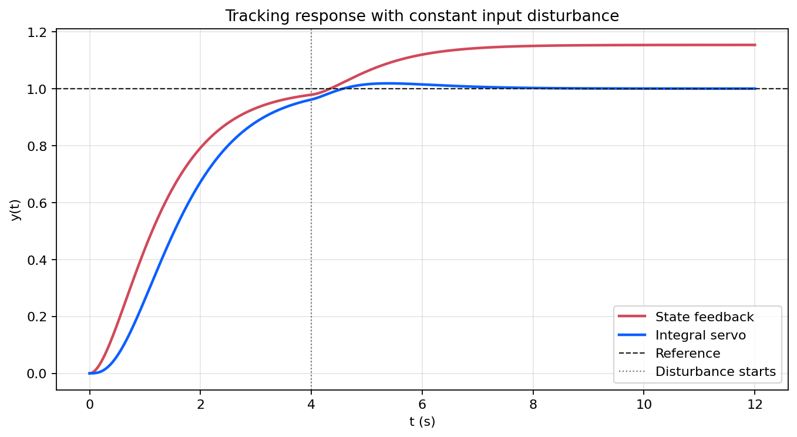

# 07 跟踪与抗扰实验

本目录复现 [`07_跟踪与抗扰`](../../../notes/07_跟踪与抗扰.md) 中的参考跟踪与扰动抑制结果，重点比较纯状态反馈和积分伺服在常值扰动下的差异。

## 关联笔记

- [07_跟踪与抗扰](../../../notes/07_跟踪与抗扰.md)

## 实验内容

- 设计纯状态反馈参考跟踪器。
- 设计带积分器的伺服控制律。
- 比较两种结构在常值扰动下的输出响应与控制输入并导出数值报告。

## 代表结果

输出响应图展示积分器对稳态误差和扰动抑制的影响。

<p align="center">
  
</p>

## 运行命令

Python 依赖见 [requirements.txt](../../../requirements.txt)。以下命令在仓库根目录执行。

```bash
python experiments/foundations/07_tracking_and_disturbance_rejection/generate_results.py
matlab -batch "run('experiments/foundations/07_tracking_and_disturbance_rejection/generate_results.m')"
```

## 输出目录

- 图像：`figures/07_tracking_and_disturbance_rejection/`
- 数值结果：`generated/07_tracking_and_disturbance_rejection/`
- `generated/` 默认只用于本地复现检查，不纳入版本控制。

## 代码入口

| 路径 | 作用 |
| --- | --- |
| `generate_results.py` | Python 版跟踪与抗扰结果生成入口 |
| `generate_results.m` | MATLAB 版结果生成入口 |
