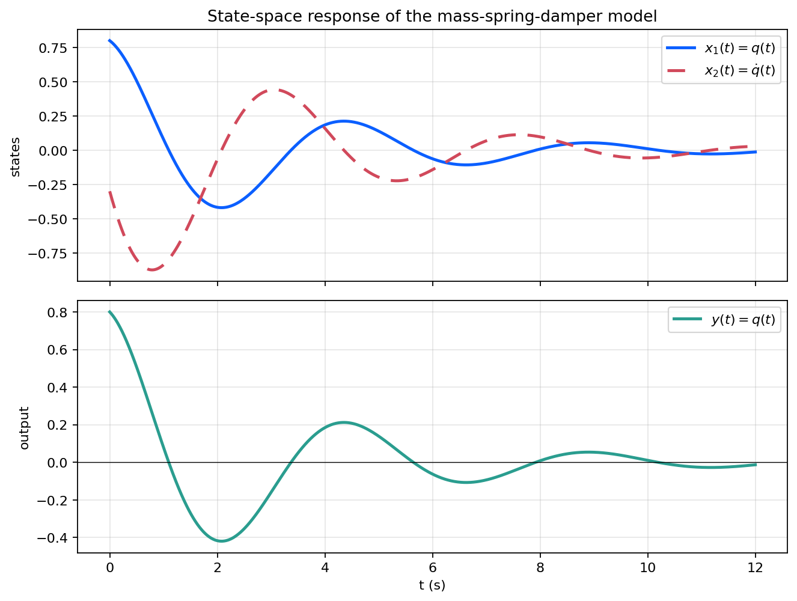
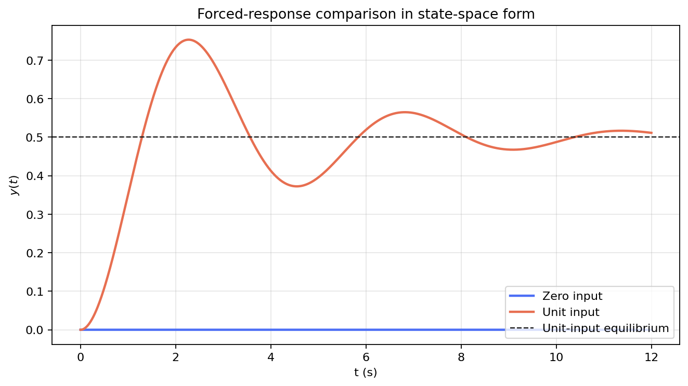

# 系统建模与状态空间基础

这篇笔记作为整条主线的起点，说明如何把一个连续时间物理系统整理成状态空间模型，并给出平衡点、矩阵指数解和输入响应的基本表达。后续稳定性、可控性、反馈设计与最优控制都以这一形式为基础。对应实验见 [`experiments/foundations/01_state_space_modeling`](../experiments/foundations/01_state_space_modeling/README.md)。

## 从物理模型到状态空间

考虑质量-弹簧-阻尼系统

```math
m\ddot q(t)+c\dot q(t)+kq(t)=u(t), \qquad y(t)=q(t).
```

取状态变量

```math
x_1(t)=q(t), \qquad x_2(t)=\dot q(t),
```

则系统可改写为

```math
\dot x(t)=Ax(t)+Bu(t), \qquad y(t)=Cx(t)+Du(t),
```

其中

```math
A=
\begin{bmatrix}
0 & 1 \\
-\frac{k}{m} & -\frac{c}{m}
\end{bmatrix},
\qquad
B=
\begin{bmatrix}
0 \\
\frac{1}{m}
\end{bmatrix},
\qquad
C=
\begin{bmatrix}
1 & 0
\end{bmatrix},
\qquad
D=0.
```

这个步骤把原本的二阶微分方程变成了一阶向量系统，也把“位移与速度”明确成了后续分析中的状态。

## 平衡点与矩阵指数

若输入为常值 $\bar u$，平衡点 $x^\star$ 满足

```math
Ax^\star+B\bar u=0.
```

因此只要矩阵 $A$ 可逆，就有

```math
x^\star=-A^{-1}B\bar u.
```

对零输入系统，状态响应可写为

```math
x(t)=e^{At}x(0).
```

对一般输入，状态空间表达进一步给出

```math
x(t)=e^{At}x(0)+\int_0^t e^{A(t-s)}Bu(s)\,ds.
```

矩阵指数控制了自由响应的衰减或发散，卷积积分则刻画外部输入如何驱动状态偏离平衡点。

## 数值模型

实验选取

```math
m=1.0, \qquad c=0.6, \qquad k=2.0,
```

得到

```math
A=
\begin{bmatrix}
0 & 1 \\
-2.0 & -0.6
\end{bmatrix},
\qquad
B=
\begin{bmatrix}
0 \\
1
\end{bmatrix},
\qquad
C=
\begin{bmatrix}
1 & 0
\end{bmatrix}.
```

自由响应初值取为

```math
x(0)=
\begin{bmatrix}
0.8 \\
-0.3
\end{bmatrix}.
```

同时比较零输入与单位常值输入下的输出变化，以说明平衡点和强迫响应之间的对应关系。

## 数值结果

自由响应同时给出位移、速度和输出随时间的变化：

<p align="center">
  
</p>

位移和速度都表现为阻尼振荡，输出与第一状态保持一致。

对比零输入与单位常值输入时，输出会向新的平衡值收敛：

<p align="center">
  
</p>

这组结果说明，状态空间模型不仅能描述自由响应，也能直接表达输入改变后新的平衡位置和过渡过程。

## 小结

状态变量选择、状态方程和输出方程构成了现代控制主线的统一建模语言。平衡点由代数方程给出，瞬态响应由矩阵指数与卷积积分表达。后续稳定性、可控性、观测器和 LQR 都以这套表达为基础继续展开。

## 复现入口

- 笔记对应脚本：[`experiments/foundations/01_state_space_modeling`](../experiments/foundations/01_state_space_modeling/README.md)
- 图像目录：`figures/01_state_space_modeling/`
- 数值输出：`generated/01_state_space_modeling/`
