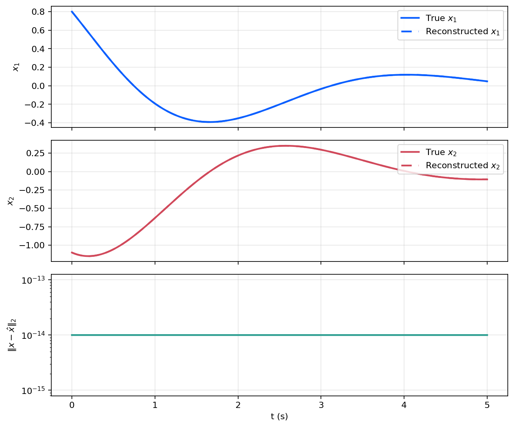

# 可控性与可观性

这篇笔记位于稳定性和反馈设计之间，讨论状态空间模型能否被输入充分驱动、能否被输出充分辨识。稳定性说明系统会如何演化，可控性与可观性则说明控制器和观测器是否有设计基础。对应实验见 [`experiments/foundations/03_controllability_observability`](../experiments/foundations/03_controllability_observability/README.md)。

## 模型与目标

考虑连续时间 LTI 系统

```math
\dot x(t)=Ax(t)+Bu(t), \qquad y(t)=Cx(t).
```

对这类系统，两个基本问题分别是：

- 输入是否能够在有限时间内驱动状态到达给定位置；
- 输出是否包含了足够的信息用于恢复状态。

第一个问题对应可控性，第二个问题对应可观性。若系统不完全可控或不完全可观，至少也希望满足稳定化和可检测这两个较弱条件。

## 两个基本判据

对二维系统，Kalman 可控性矩阵与可观性矩阵分别为

```math
\mathcal C=
\begin{bmatrix}
B & AB
\end{bmatrix},
\qquad
\mathcal O=
\begin{bmatrix}
C \\
CA
\end{bmatrix}.
```

若

```math
\mathrm{rank}(\mathcal C)=n,
```

则系统完全可控；若

```math
\mathrm{rank}(\mathcal O)=n,
```

则系统完全可观。

同一结论也可用 PBH 判据表述。对矩阵 $A$ 的任一特征值 $\lambda$，若

```math
\mathrm{rank}
\begin{bmatrix}
\lambda I-A & B
\end{bmatrix}
=n,
```

则该模态可控；若

```math
\mathrm{rank}
\begin{bmatrix}
\lambda I-A \\
C
\end{bmatrix}
=n,
```

则该模态可观。稳定化与可检测本质上就是把这些判据限制在不稳定模态上检查。

## 最小能量控制与状态重构

可控性不仅决定“能否到达”，还决定“如何到达”。对有限时间转移问题

```math
x(0)=x_0, \qquad x(T)=x_f,
```

若可控 Gramian 可逆，则最小输入能量控制可以显式写出。

可观性则对应“能否从输出倒推状态”。当采样输出构成的离散可观性矩阵可逆时，有限组输出样本就足以恢复初始状态。这个结论为后续观测器设计提供了静态版本的基础。

## 数值结果

实验采用二维系统，先计算有限时间最小能量控制，把状态从给定初值驱动到目标状态：

<p align="center">
  
</p>

状态轨迹在给定终端时间附近到达目标点，输入信号保持有限幅值。

随后用两组输出样本恢复初始状态，并比较真实状态与重构状态：

<p align="center">
  
</p>

重构轨迹与真实轨迹几乎重合，说明该模型在所选输出下具备足够的可观性。

## 小结

可控性和可观性给出了“能否设计控制器”和“能否设计状态估计器”的前置条件。最小能量控制把可控性落到状态转移问题上，有限样本重构则把可观性落到输出辨识问题上。后续状态反馈、观测器和分离原理都依赖这一层结论。

## 复现入口

- 笔记对应脚本：[`experiments/foundations/03_controllability_observability`](../experiments/foundations/03_controllability_observability/README.md)
- 图像目录：`figures/03_controllability_observability/`
- 数值输出：`generated/03_controllability_observability/`
