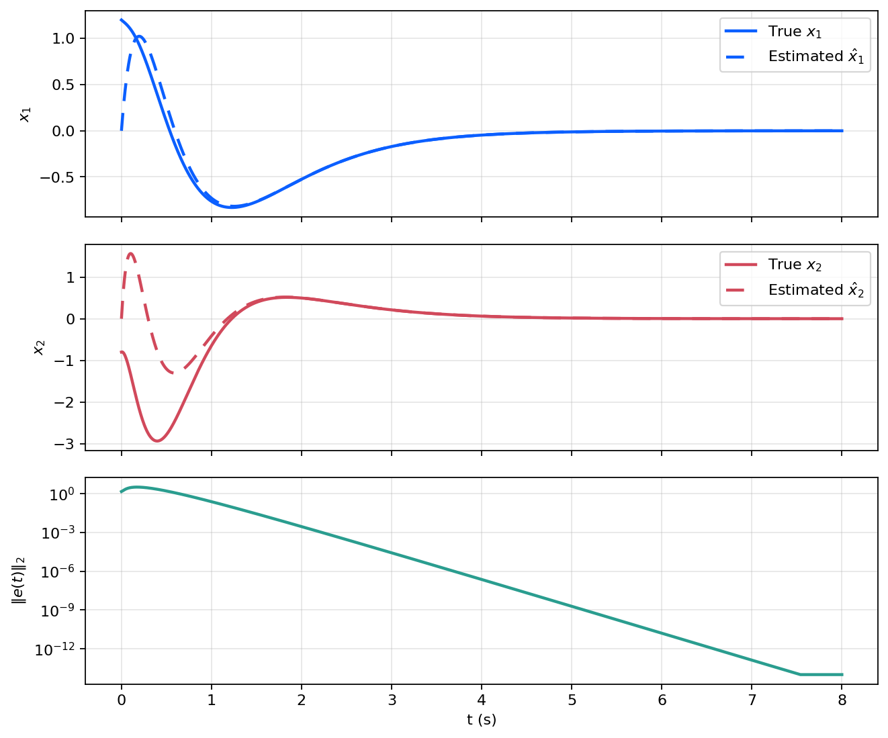
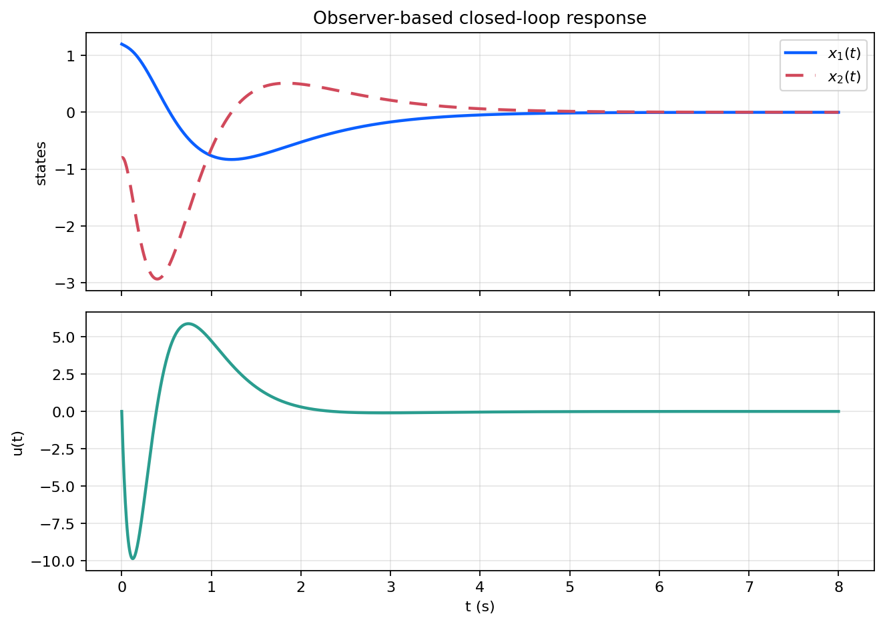

# 观测器与分离原理

这篇笔记沿着“可观性之后、动态输出反馈之前”的标准位置展开，讨论如何用输出信号实时估计状态，并说明观测器与状态反馈可以分开设计。对应实验见 [`experiments/foundations/05_observer_and_separation`](../experiments/foundations/05_observer_and_separation/README.md)。

## 模型与目标

考虑系统

```math
\dot x(t)=Ax(t)+Bu(t), \qquad y(t)=Cx(t).
```

当状态无法直接测量时，可构造 Luenberger 观测器

```math
\dot{\hat x}(t)=A\hat x(t)+Bu(t)+L\bigl(y(t)-C\hat x(t)\bigr),
```

其中 $\hat x(t)$ 是状态估计，$L$ 是观测器增益。

目标是在只使用输出测量的情况下，让估计误差

```math
e(t)=\hat x(t)-x(t)
```

渐近收敛到零。

## 误差系统与极点配置

将真实系统与观测器相减，得到误差系统

```math
\dot e(t)=(A-LC)e(t).
```

因此只要矩阵 $A-LC$ 是 Hurwitz，估计误差就会指数衰减。这个结构与状态反馈中的

```math
\dot x(t)=(A+BK)x(t)
```

完全平行，只是极点配置对象从 $A+BK$ 换成了 $A-LC$。

若 $(A,C)$ 可观，则可以通过选择 $L$ 把观测误差极点放到期望位置。实践中常把观测器极点选得比控制器极点更快，以便估计误差先于闭环状态衰减。

## 分离原理

设控制律采用

```math
u(t)=K\hat x(t),
```

则闭环系统同时包含控制器和观测器两个模块。分离原理说明：

1. 只要 $(A,B)$ 可稳定化，就可单独设计状态反馈增益 $K$；
2. 只要 $(A,C)$ 可检测，就可单独设计观测器增益 $L$；
3. 组合后的增广闭环极点由 $A+BK$ 与 $A-LC$ 两部分共同构成。

因此，状态反馈设计与观测器设计在结构上可以解耦处理。

## 数值结果

实验先给出真实状态与估计状态的对比：

<p align="center">
  
</p>

两组状态在初期存在明显偏差，但估计误差迅速衰减到零附近。

随后把观测器与状态反馈组合成估计器闭环：

<p align="center">
  
</p>

闭环状态和控制输入都保持有界并收敛，说明观测器误差衰减并未破坏原有的稳定闭环结构。

## 小结

观测器把“可观性”推进到动态状态估计，把“输出可辨识”变成了“实时可恢复”。分离原理则说明，状态反馈与观测器可以分别设计，再组合成动态输出反馈结构。这一层使现代控制主线从静态判据进入可实现控制器。

## 复现入口

- 笔记对应脚本：[`experiments/foundations/05_observer_and_separation`](../experiments/foundations/05_observer_and_separation/README.md)
- 图像目录：`figures/05_observer_and_separation/`
- 数值输出：`generated/05_observer_and_separation/`
