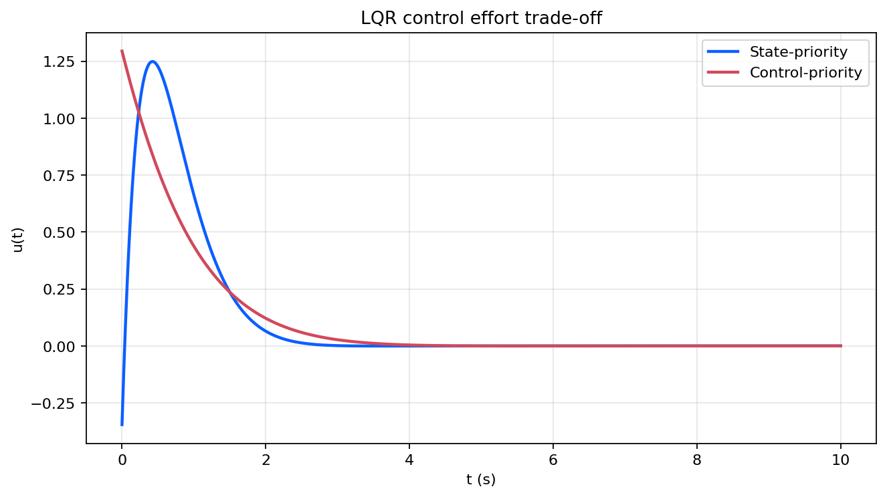

# 最优控制

这篇笔记位于状态反馈和跟踪抗扰之间，讨论连续时间 LQR 如何在稳定闭环的同时平衡状态偏差与控制能量。与前面“先给出极点再配置”的设计方式相比，最优控制把权重选择直接写入性能指标。对应实验见 [`experiments/foundations/06_optimal_control`](../experiments/foundations/06_optimal_control/README.md)。

## 问题设置

考虑系统

```math
\dot x(t)=Ax(t)+Bu(t).
```

连续时间二次型性能指标取为

```math
J=\int_0^\infty \bigl(x^T(t)Qx(t)+u^T(t)Ru(t)\bigr)\,dt,
```

其中

```math
Q\succeq 0, \qquad R\succ 0.
```

矩阵 $Q$ 用于惩罚状态偏差，矩阵 $R$ 用于惩罚控制能量。目标是在所有稳定化控制律中，使代价 $J$ 最小。

## Riccati 方程与 LQR

对连续时间 LQR，若存在对称正定矩阵 $P$ 满足代数 Riccati 方程

```math
A^TP+PA-PBR^{-1}B^TP+Q=0,
```

则最优状态反馈可写为

```math
u(t)=Kx(t), \qquad K=-R^{-1}B^TP.
```

此时闭环矩阵为

```math
A+BK=A-BR^{-1}B^TP.
```

Riccati 方程把最优控制问题重新整理成一个矩阵方程，而不是显式求解所有可能控制输入。

## 权重选择的含义

不同的 $(Q,R)$ 选择体现了不同设计偏好：

- 较大的 $Q$ 往往使状态更快收敛，但控制幅值也会更大；
- 较大的 $R$ 会抑制控制输入，但闭环响应通常更保守。

因此 LQR 不再直接指定闭环极点，而是通过权重矩阵间接决定响应速度与控制能量之间的折中。

## 数值结果

实验对比两组权重：一组更强调状态收敛，一组更强调控制节制。对应状态响应如下：

<p align="center">
  
</p>

强调状态的权重会产生更快的收敛过程，而强调控制的权重则得到更平缓的状态变化。

相应控制输入如下：

<p align="center">
  
</p>

更快的状态压缩通常对应更大的控制峰值，这正是性能指标中 $Q$ 与 $R$ 之间折中的直接体现。

## 小结

LQR 把反馈设计从“满足稳定性”推进到“优化性能”。Riccati 方程提供了可计算的最优增益，而权重矩阵提供了明确的折中参数。后续跟踪与抗扰章节可以在这一基础上继续引入参考输入和扰动抑制要求。

## 复现入口

- 笔记对应脚本：[`experiments/foundations/06_optimal_control`](../experiments/foundations/06_optimal_control/README.md)
- 图像目录：`figures/06_optimal_control/`
- 数值输出：`generated/06_optimal_control/`
