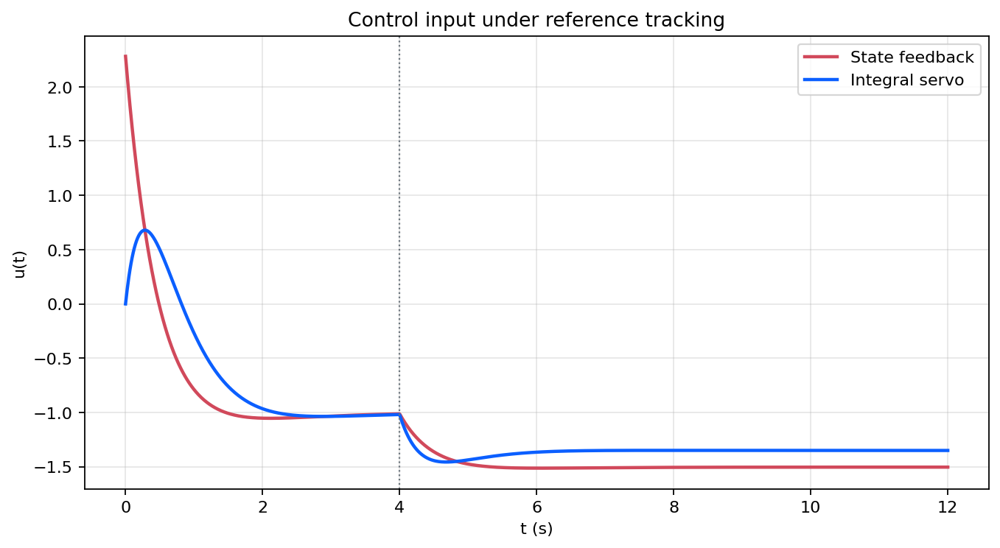

# 跟踪与抗扰

这篇笔记把前面的稳定化与最优设计推进到更常见的控制目标：不仅要收敛，还要跟踪参考输入并抑制常值扰动。对应实验见 [`experiments/foundations/07_tracking_and_disturbance_rejection`](../experiments/foundations/07_tracking_and_disturbance_rejection/README.md)。

## 模型与目标

考虑系统

```math
\dot x(t)=Ax(t)+Bu(t)+Bd(t), \qquad y(t)=Cx(t),
```

其中 $r(t)$ 为参考输入，$d(t)$ 为外部扰动。目标从“把状态压回原点”变成“让输出跟踪参考，同时维持扰动下的小稳态误差”。

若只采用纯状态反馈

```math
u(t)=Kx(t)+Nr(t),
```

则在模型匹配良好且无持续扰动时可以实现参考跟踪；但对常值扰动，输出往往会出现稳态偏差。

## 积分增广与稳态误差

为了消除常值扰动和常值参考下的稳态误差，可引入积分状态

```math
\dot \xi(t)=r(t)-y(t),
```

并采用增广控制律

```math
u(t)=K_xx(t)+K_i\xi(t).
```

这样一来，闭环不仅调节状态，还会累计跟踪误差。只要增广系统可稳定化，积分器就能把常值偏差压缩到零附近。

## 数值结果

实验比较纯状态反馈和积分伺服在常值参考下的表现，并在中途加入输入扰动：

<p align="center">
  
</p>

纯状态反馈在扰动加入后会保留明显的稳态偏差，而积分伺服能够重新把输出拉回参考值附近。

相应控制输入如下：

<p align="center">
  
</p>

积分器通常会在扰动出现后提供额外校正量，因此控制输入会出现新的过渡过程。

## 小结

跟踪与抗扰把状态反馈从“调节问题”推进到“伺服问题”。积分增广是最常见的零稳态误差实现方式，也为后续采样实现、鲁棒分析和更复杂系统中的参考跟踪奠定了基础。

## 复现入口

- 笔记对应脚本：[`experiments/foundations/07_tracking_and_disturbance_rejection`](../experiments/foundations/07_tracking_and_disturbance_rejection/README.md)
- 图像目录：`figures/07_tracking_and_disturbance_rejection/`
- 数值输出：`generated/07_tracking_and_disturbance_rejection/`
